Clustering
================

Created by: Ahmed Mahfouz

# Overview

In this tutorial we will look at different approaches to clustering
scRNA-seq datasets in order to characterize the different subgroups of
cells. Using unsupervised clustering, we will try to identify groups of
cells based on the similarities of the transcriptomes without any prior
knowledge of the labels.

Load required packages:

``` r
suppressMessages(require(tidyverse))
suppressMessages(require(Seurat))
suppressMessages(require(cowplot))
suppressMessages(require(scater))
suppressMessages(require(scran))
suppressMessages(require(igraph))
```

## Datasets

In this tutorial, we will use a small dataset of cells from developing
mouse embryo [Deng et
al. 2014](https://science.sciencemag.org/content/343/6167/193). We have
preprocessed the dataset and created a `SingleCellExperiment` object in
advance. We have also annotated the cells with the cell types identified
in the original publication (it is the `cell_type2` column in the
`colData` slot).

``` r
#load expression matrix
deng <- readRDS("deng-reads.rds")
deng
```

    ## class: SingleCellExperiment 
    ## dim: 22431 268 
    ## metadata(0):
    ## assays(2): counts logcounts
    ## rownames(22431): Hvcn1 Gbp7 ... Sox5 Alg11
    ## rowData names(10): feature_symbol is_feature_control ...
    ##   total_counts log10_total_counts
    ## colnames(268): 16cell 16cell.1 ... zy.2 zy.3
    ## colData names(30): cell_type2 cell_type1 ... pct_counts_ERCC
    ##   is_cell_control
    ## reducedDimNames(0):
    ## spikeNames(1): ERCC
    ## altExpNames(0):

``` r
#look at the cell type annotation
table(colData(deng)$cell_type2)
```

    ## 
    ##     16cell      4cell      8cell early2cell earlyblast  late2cell 
    ##         50         14         37          8         43         10 
    ##  lateblast   mid2cell   midblast         zy 
    ##         30         12         60          4

## Feature selection

The first step is to decide which genes to use in clustering the cells.
Single cell RNA-seq can profile a huge number of genes in a lot of
cells. But most of the genes are not expressed enough to provide a
meaningful signal and are often driven by technical noise. Including
them could potentially add some unwanted signal that would blur the
biological variation. Moreover gene filtering can also speed up the
computational time for downstream analysis.

First let’s have a look at the average expression and the variance of
all genes. Which genes seem less important and which are likely to be
technical noise?

``` r
#Calculate gene mean across cell
gene_mean <- rowMeans(counts(deng)) 

#Calculate gene variance across cell
gene_var  <- rowVars(counts(deng))  

#ggplot plot
gene_stat_df <- tibble(gene_mean,gene_var)
ggplot(data=gene_stat_df ,aes(x=log(gene_mean), y=log(gene_var))) + geom_point(size=0.5)  + theme_classic()
```

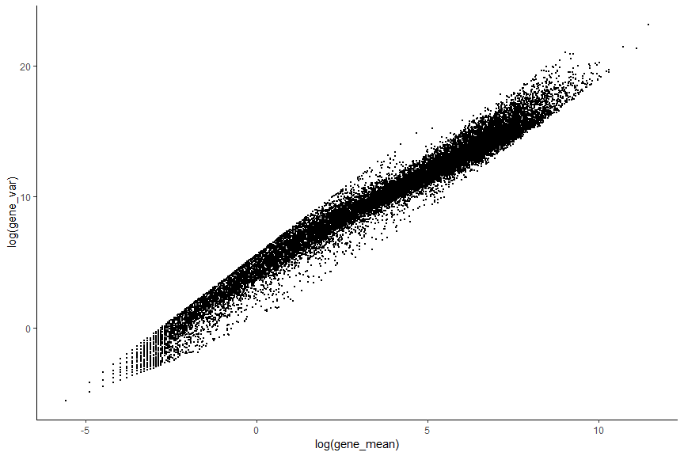<!-- -->

#### Filtering out low abundance genes

Low-abundance genes are mostly non informative and are not
representative of the biological variance of the data. They are often
driven by technical noise such as dropout event. However, their presence
in downstream analysis leads often to a lower accuracy since they can
interfere with some statistical model that will be used and also will
pointlessly increase the computational time which can be critical when
working with very large data.

``` r
abundant_genes <- gene_mean >= 0.5 #Remove Low abundance genes
# plot low abundance gene filtering
hist(log10(gene_mean), breaks=100, main="", col="grey80",
     xlab=expression(Log[10]~"average count"))
abline(v=log10(0.5), col="red", lwd=2, lty=2)
```

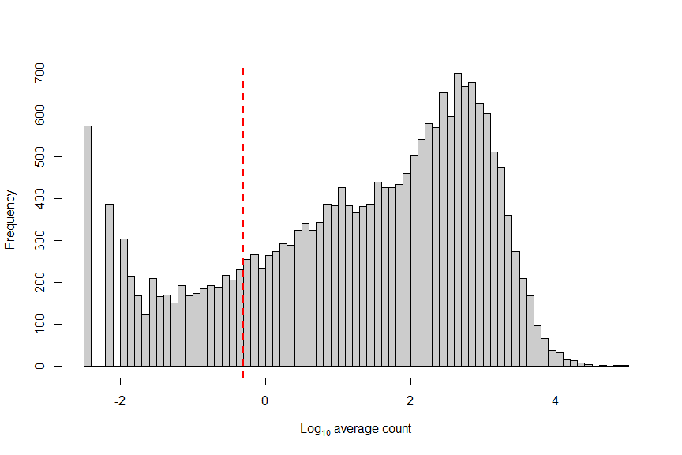<!-- -->

``` r
#remove low abundance gene in SingleCellExperiment Object 
deng <- deng[abundant_genes,]
dim(deng)
```

    ## [1] 17093   268

#### Filtering genes that are expressed in very few cells

We can also filter some genes that are in a small number of cells. This
procedure would remove some outlier genes that are highly expressed in
one or two cells. These genes are unwanted for further analysis since
they mostly comes from an irregular amplification of artifacts. It is
important to note that we might not want to filter with this procedure
when the aim of the analysis is to detect a very rare subpopulation in
the data.

``` r
#Calculate the number of non zero expression for each genes
numcells <- nexprs(deng, byrow=TRUE) 

#Filter genes detected in less than 5 cells
numcells2 <- numcells >= 5
deng <- deng[numcells2,]
dim(deng)
```

    ## [1] 16946   268

#### Detecting Highly Variable Genes

HVG assumes that if genes have large differences in expression across
cells some of those differences are due to biological difference between
the cells rather than technical noise. However,there is a positive
relationship between the mean expression of a gene and the variance in
the read counts across cells. Keeping only high variance genes, will
lead to keeping a lot of highly expressed housekeeping genes that are
expressed in every cells and are not representative of the biological
variance. This relationship must be corrected for to properly identify
HVGs.

We can use one of the following methods (RUN ONLY ONE) to determine the
highly variable genes.

**Option 1:** Model the coefficient of variation as a function of the
mean.

``` r
# out <- modelGeneCV2(deng, assay.type= "counts")
# out$genes <- rownames(deng)
# out$HVG <- (out$FDR<0.05)
# out <- as_tibble(out)

# plot highly variable genes
# ggplot(data = out) + 
#     geom_point(aes(x=log2(mean), y=log2(total), color=HVG), size=0.5) + 
#     geom_point(aes(x=log2(mean), y=log2(trend)), color="red", size=0.1)
```

**Option 2:** Model the variance of the biological component as a
function of the mean.

First we estimation the variance in expression for each gene, followed
by decomposition of the variance into biological and technical
components. HVGs are then identified as those genes with the largest
biological components. This avoids prioritizing genes that are highly
variable due to technical factors such as sampling noise during RNA
capture and library preparation. see the [scran
vignette](https://bioconductor.org/packages/devel/bioc/vignettes/scran/inst/doc/scran.html#5_variance_modelling)
for details.

``` r
fit <- trendVar(deng, parametric=TRUE, use.spikes = FALSE)
dec <- decomposeVar(deng, fit)
dec$HVG <- (dec$FDR<0.00001)
hvg_genes <- rownames(dec[dec$FDR < 0.00001, ])

# plot highly variable genes
plot(dec$mean, dec$total, pch=16, cex=0.6, xlab="Mean log-expression",
     ylab="Variance of log-expression")
o <- order(dec$mean)
lines(dec$mean[o], dec$tech[o], col="dodgerblue", lwd=2)
points(dec$mean[dec$HVG], dec$total[dec$HVG], col="red", pch=16)
```

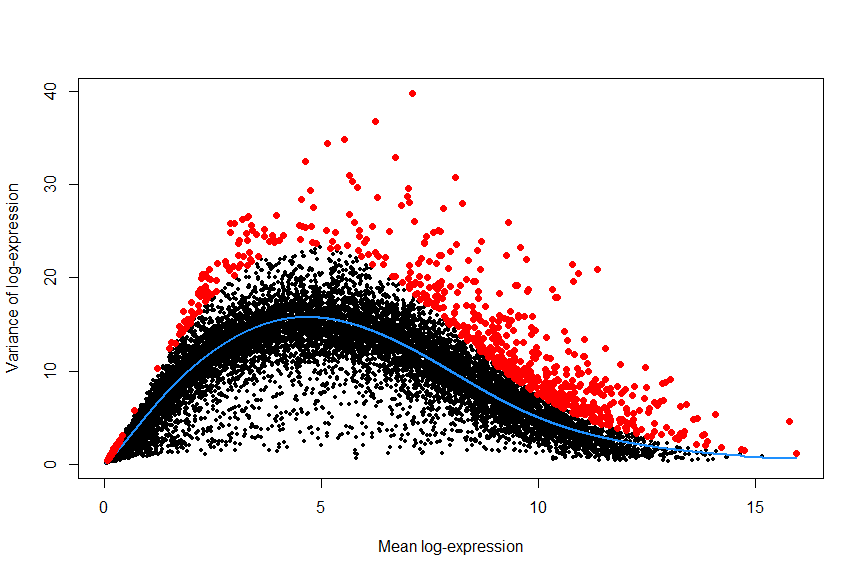<!-- -->

``` r
## save the decomposed variance table and hvg_genes into metadata for safekeeping
metadata(deng)$hvg_genes <- hvg_genes
metadata(deng)$dec_var <- dec
```

## Dimensionality reduction

The clustering problem is computationally difficult due to the high
level of noise (both technical and biological) and the large number of
dimensions (i.e. genes). We can solve these problems by applying
dimensionality reduction methods (e.g. PCA, tSNE, and UMAP)

``` r
#PCA (select the number of components to calculate)
deng <- runPCA(deng,
             ncomponents = 30,
             subset_row = metadata(deng)$hvg_genes)

#Make a scree plot (percentage variance explained per PC) to determine the number of relevant components
X <- attributes(deng@reducedDims$PCA)
plot(attr(reducedDim(deng), "percentVar")~c(1:30), type="b", lwd=1, ylab="Percentage variance" , xlab="PCs" , bty="l" , pch=1)
```

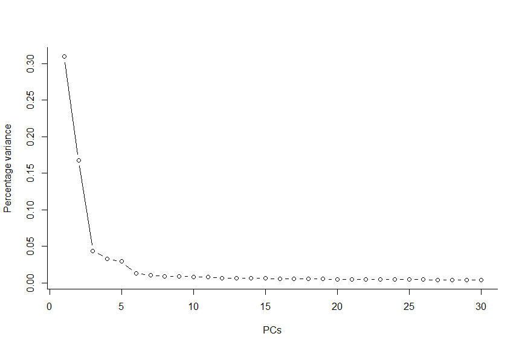<!-- -->

Make a PCA plot (PC1 vs. PC2)

``` r
plotReducedDim(deng, "PCA", colour_by = "cell_type2")
```

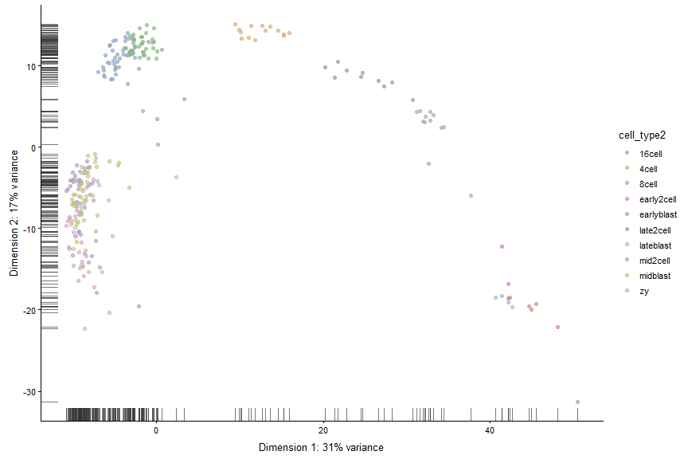<!-- -->

Make a tSNE plot *Note:* tSNE is a stochastic method. Everytime you run
it you will get slightly different results. For convenience we can get
the same results if we seet the seed.

``` r
#tSNE
deng <- runTSNE(deng,
              perplexity = 30,
              feature_set = metadata(deng)$hvg_genes,
              set.seed = 1)


plotReducedDim(deng, "TSNE", colour_by = "cell_type2")
```

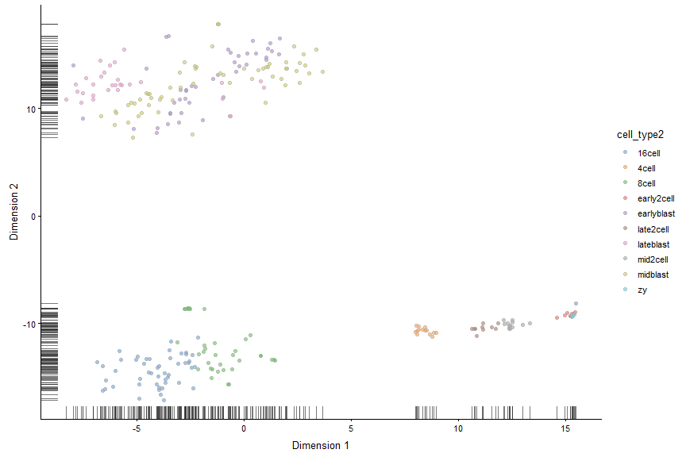<!-- -->

## Clustering

### Hierarchical clustering

``` r
# Calculate Distances (default: Eucledian distance)
distance_eucledian <- dist(t(logcounts(deng)))

#Perform hierarchical clustering using ward linkage
ward_hclust_eucledian <- hclust(distance_eucledian,method = "ward.D2")
plot(ward_hclust_eucledian, main = "dist = eucledian, Ward linkage")
```

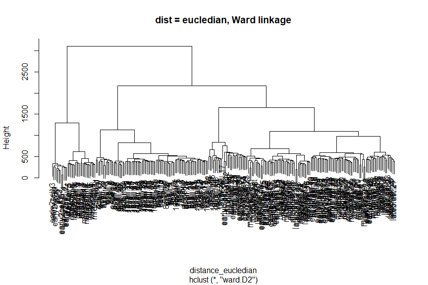<!-- -->

Now cut the dendrogram to generate 10 clusters and plot the cluster
labels on the PCA plot.

``` r
#Cutting the cluster tree to make 10 groups
cluster_hclust <- cutree(ward_hclust_eucledian,k = 10)
colData(deng)$cluster_hclust <- factor(cluster_hclust)

plot_grid(plotReducedDim(deng, "PCA", colour_by = "cluster_hclust"),
          plotReducedDim(deng, "PCA", colour_by = "cell_type2"))
```

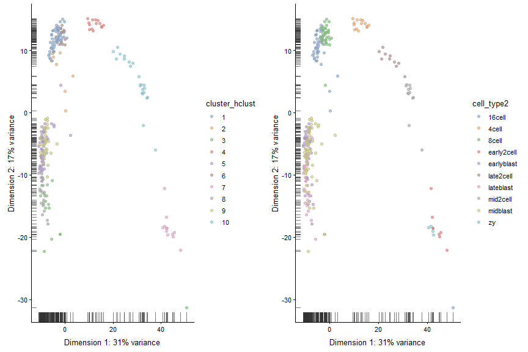<!-- -->

Plot the cluster labels on the tSNE plot.

``` r
plot_grid(plotReducedDim(deng, "TSNE", colour_by = "cluster_hclust"),
          plotReducedDim(deng, "TSNE", colour_by = "cell_type2"))
```

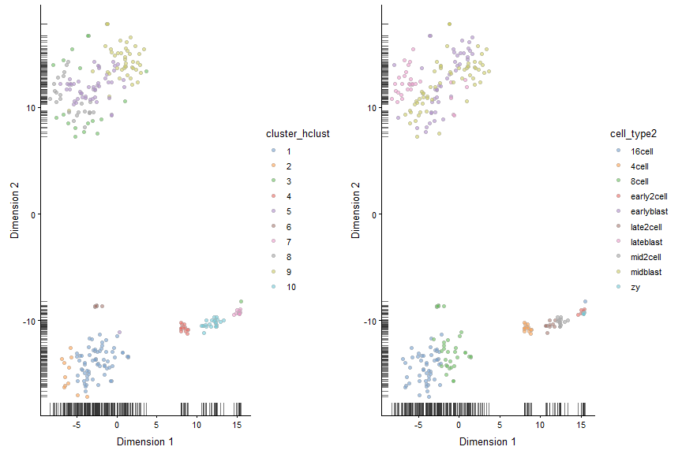<!-- -->

Now let’s try a different distance measure. A commonly used distance
measure is 1 - correlation.

``` r
# Calculate Distances (1 - correlation)
C <- cor(logcounts(deng))

# Run clustering based on the correlations, where the distance will 
# be 1-correlation, e.g. higher distance with lower correlation.
distance_corr <- as.dist(1-C) 
    
#Perform hierarchical clustering using ward linkage
ward_hclust_corr <- hclust(distance_corr,method="ward.D2")
plot(ward_hclust_corr, main = "dist = 1-corr, Ward linkage")
```

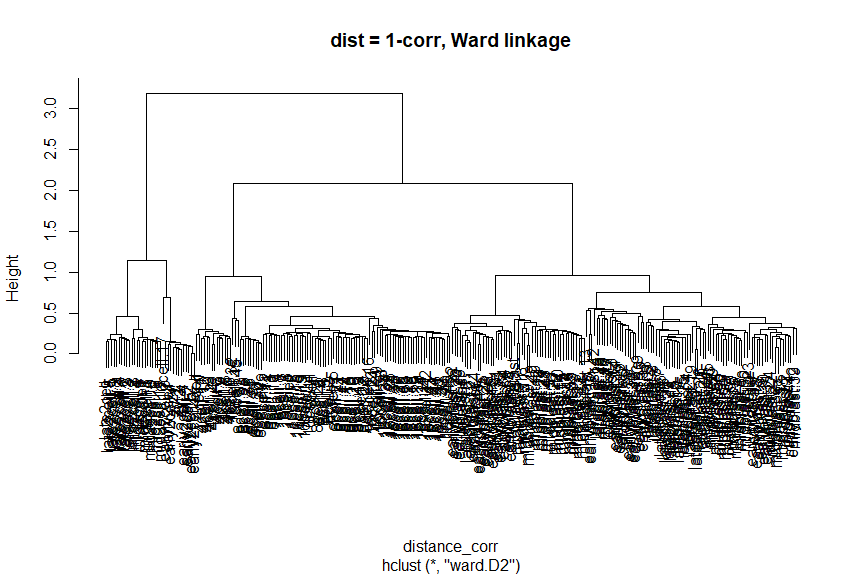<!-- -->

Again, let’s cut the dendrogram to generate 10 clusters and plot the
cluster labels on the PCA plot.

``` r
#Cutting the cluster tree to make 10 groups
cluster_hclust <- cutree(ward_hclust_corr,k = 10)
colData(deng)$cluster_hclust <- factor(cluster_hclust)

plot_grid(plotReducedDim(deng, "PCA", colour_by = "cluster_hclust"),
          plotReducedDim(deng, "PCA", colour_by = "cell_type2"))
```

<!-- -->

Instead of changing the distance metric, we can change the linkage
method. Instead of using Ward’s method, let’s use complete linkage.

``` r
# Calculate Distances (default: Eucledian distance)
distance_eucledian <- dist(t(logcounts(deng)))

#Perform hierarchical clustering using ward linkage
comp_hclust_eucledian <- hclust(distance_eucledian,method = "complete")
plot(comp_hclust_eucledian, main = "dist = eucledian, complete linkage")
```

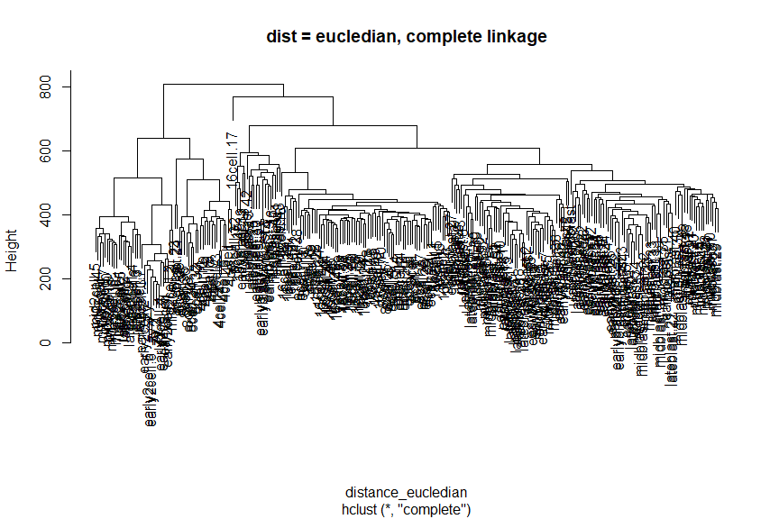<!-- -->

Once more, let’s cut the dendrogram to generate 10 clusters and plot the
cluster labels on the PCA plot.

``` r
#Cutting the cluster tree to make 10 groups
cluster_hclust <- cutree(comp_hclust_eucledian,k = 10)
colData(deng)$cluster_hclust <- factor(cluster_hclust)

plot_grid(plotReducedDim(deng, "PCA", colour_by = "cluster_hclust"),
          plotReducedDim(deng, "PCA", colour_by = "cell_type2"))
```

<!-- -->

### TSNE + Kmeans

``` r
# Do kmeans algorithm on TSNE coordinates
deng_kmeans <- kmeans(x = reducedDim(deng, "TSNE"),centers = 10)
TSNE_kmeans <- factor(deng_kmeans$cluster)
colData(deng)$TSNE_kmeans <- TSNE_kmeans
#Compare with ground truth
plot_grid(plotTSNE(deng, colour_by = "TSNE_kmeans"),
          plotTSNE(deng, colour_by = "cell_type2"))
```

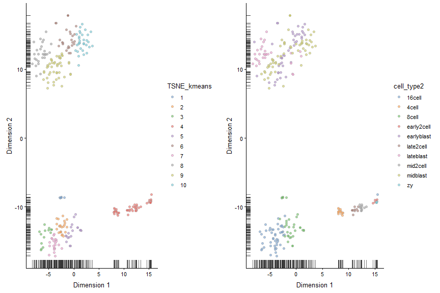<!-- -->

### Graph Based Clustering

``` r
#k=5
#The k parameter defines the number of closest cells to look for each cells
SNNgraph_k5 <- buildSNNGraph(x = deng, k=5) 
SNNcluster_k5 <- cluster_louvain(SNNgraph_k5)
colData(deng)$SNNcluster_k5 <- factor(SNNcluster_k5$membership)
p5<- plotPCA(deng, colour_by="SNNcluster_k5")+ guides(fill=guide_legend(ncol=2))

# k30
SNNgraph_k30 <- buildSNNGraph(x = deng, k=30) 
SNNcluster_k30 <- cluster_louvain(SNNgraph_k30)
colData(deng)$SNNcluster_k30 <- factor(SNNcluster_k30$membership)
p30 <- plotPCA(deng, colour_by="SNNcluster_k30")

#plot the different clustering.
plot_grid(p5+ guides(fill=guide_legend(ncol=1)),p30) 
```

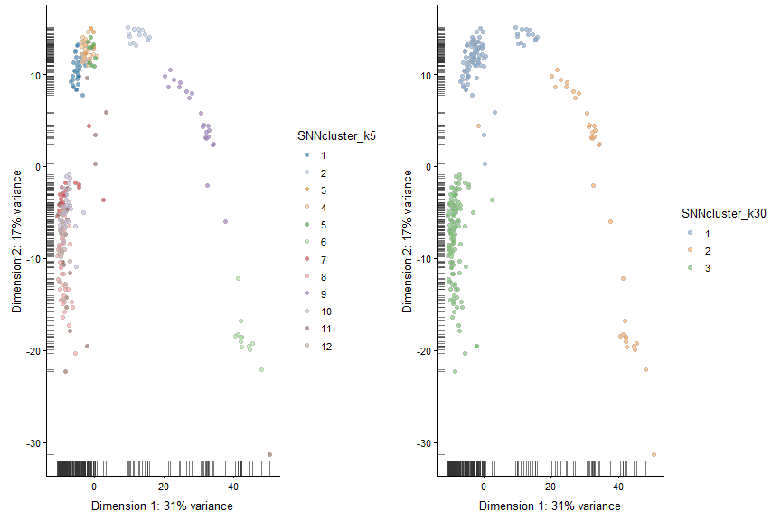<!-- -->

### Session info

``` r
sessionInfo()
```

    ## R version 3.6.1 (2019-07-05)
    ## Platform: x86_64-conda_cos6-linux-gnu (64-bit)
    ## Running under: KDE neon User Edition 5.19
    ## 
    ## Matrix products: default
    ## BLAS/LAPACK: /home/mochar/anaconda3/envs/poep/lib/R/lib/libRblas.so
    ## 
    ## locale:
    ## [1] nl_NL.UTF-8
    ## 
    ## attached base packages:
    ## [1] parallel  stats4    stats     graphics  grDevices utils     datasets 
    ## [8] methods   base     
    ## 
    ## other attached packages:
    ##  [1] igraph_1.2.4.1              scran_1.14.6               
    ##  [3] scater_1.14.6               SingleCellExperiment_1.8.0 
    ##  [5] SummarizedExperiment_1.16.1 DelayedArray_0.12.3        
    ##  [7] BiocParallel_1.20.1         matrixStats_0.57.0         
    ##  [9] Biobase_2.46.0              GenomicRanges_1.38.0       
    ## [11] GenomeInfoDb_1.22.1         IRanges_2.20.2             
    ## [13] S4Vectors_0.24.4            BiocGenerics_0.32.0        
    ## [15] cowplot_1.1.0               Seurat_3.0.2               
    ## [17] forcats_0.4.0               stringr_1.4.0              
    ## [19] dplyr_0.8.0.1               purrr_0.3.2                
    ## [21] readr_1.3.1                 tidyr_0.8.3                
    ## [23] tibble_2.1.1                ggplot2_3.3.2              
    ## [25] tidyverse_1.2.1            
    ## 
    ## loaded via a namespace (and not attached):
    ##   [1] ggbeeswarm_0.6.0         Rtsne_0.15              
    ##   [3] colorspace_1.4-1         ggridges_0.5.2          
    ##   [5] XVector_0.26.0           BiocNeighbors_1.4.2     
    ##   [7] rstudioapi_0.10          listenv_0.8.0           
    ##   [9] ggrepel_0.8.2            lubridate_1.7.4         
    ##  [11] xml2_1.2.0               codetools_0.2-16        
    ##  [13] splines_3.6.1            R.methodsS3_1.8.1       
    ##  [15] knitr_1.22               jsonlite_1.6            
    ##  [17] broom_0.5.2              ica_1.0-2               
    ##  [19] cluster_2.0.8            png_0.1-7               
    ##  [21] R.oo_1.24.0              sctransform_0.3.1       
    ##  [23] compiler_3.6.1           httr_1.4.0              
    ##  [25] dqrng_0.2.1              backports_1.1.4         
    ##  [27] assertthat_0.2.1         Matrix_1.2-17           
    ##  [29] lazyeval_0.2.2           limma_3.42.2            
    ##  [31] cli_1.1.0                BiocSingular_1.2.2      
    ##  [33] htmltools_0.3.6          tools_3.6.1             
    ##  [35] rsvd_1.0.3               GenomeInfoDbData_1.2.2  
    ##  [37] gtable_0.3.0             glue_1.3.1              
    ##  [39] RANN_2.6.1               reshape2_1.4.3          
    ##  [41] Rcpp_1.0.1               cellranger_1.1.0        
    ##  [43] vctrs_0.3.4              ape_5.4-1               
    ##  [45] nlme_3.1-139             DelayedMatrixStats_1.8.0
    ##  [47] gbRd_0.4-11              lmtest_0.9-38           
    ##  [49] xfun_0.6                 globals_0.13.1          
    ##  [51] rbibutils_1.3            rvest_0.3.3             
    ##  [53] irlba_2.3.3              statmod_1.4.34          
    ##  [55] future_1.19.1            edgeR_3.28.1            
    ##  [57] zlibbioc_1.32.0          MASS_7.3-51.3           
    ##  [59] zoo_1.8-6                scales_1.0.0            
    ##  [61] hms_0.4.2                RColorBrewer_1.1-2      
    ##  [63] yaml_2.2.0               reticulate_1.16         
    ##  [65] pbapply_1.4-3            gridExtra_2.3           
    ##  [67] stringi_1.4.3            bitops_1.0-6            
    ##  [69] Rdpack_2.0               SDMTools_1.1-221.2      
    ##  [71] rlang_0.4.7              pkgconfig_2.0.2         
    ##  [73] evaluate_0.13            lattice_0.20-38         
    ##  [75] ROCR_1.0-11              labeling_0.3            
    ##  [77] htmlwidgets_1.3          tidyselect_0.2.5        
    ##  [79] plyr_1.8.4               magrittr_1.5            
    ##  [81] R6_2.4.0                 generics_0.0.2          
    ##  [83] pillar_1.3.1             haven_2.3.1             
    ##  [85] withr_2.1.2              fitdistrplus_1.1-1      
    ##  [87] RCurl_1.98-1.2           survival_2.44-1.1       
    ##  [89] future.apply_1.6.0       tsne_0.1-3              
    ##  [91] modelr_0.1.4             crayon_1.3.4            
    ##  [93] KernSmooth_2.23-15       plotly_4.9.2.1          
    ##  [95] rmarkdown_1.12           viridis_0.5.1           
    ##  [97] locfit_1.5-9.4           grid_3.6.1              
    ##  [99] readxl_1.3.1             data.table_1.12.2       
    ## [101] metap_1.1                digest_0.6.18           
    ## [103] R.utils_2.10.1           munsell_0.5.0           
    ## [105] beeswarm_0.2.3           viridisLite_0.3.0       
    ## [107] vipor_0.4.5
