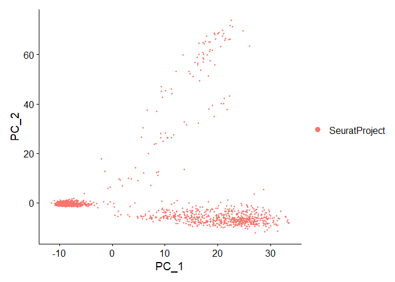
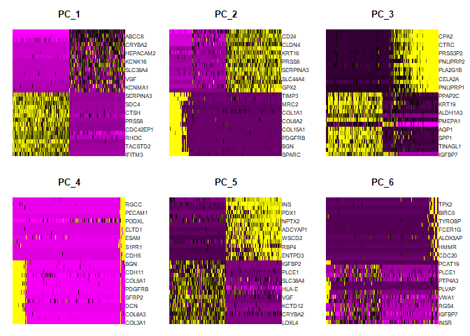
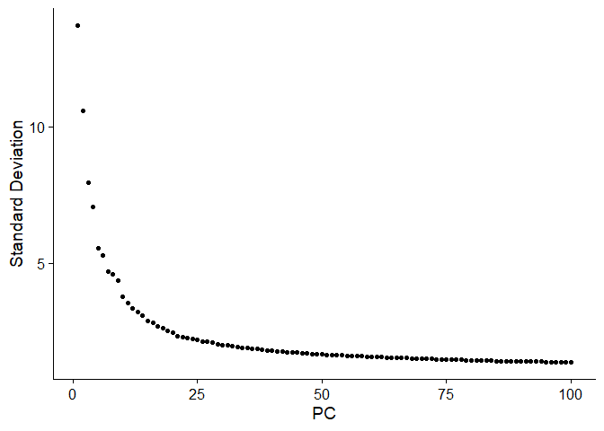
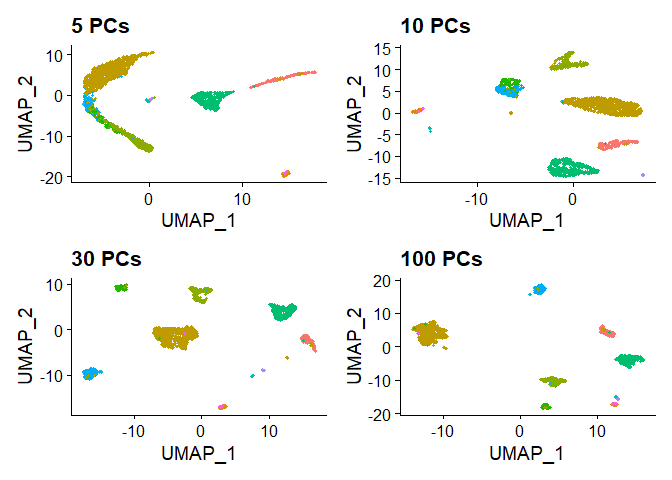
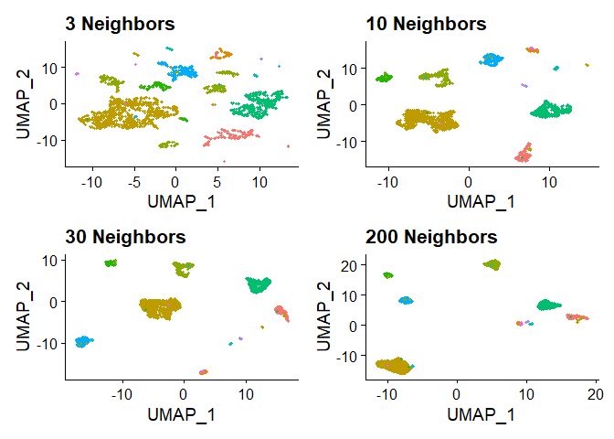
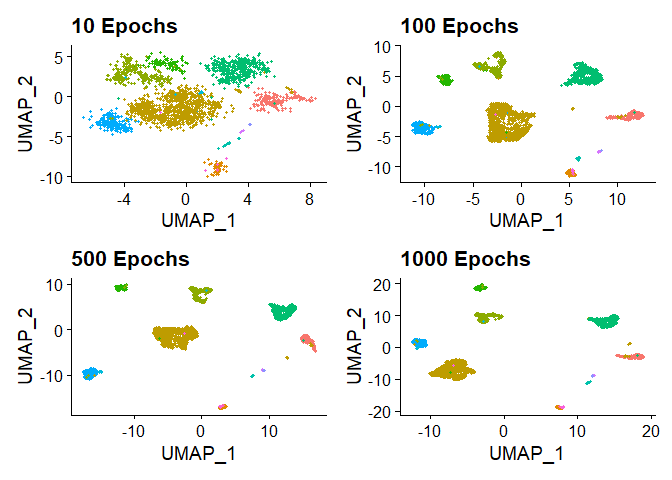
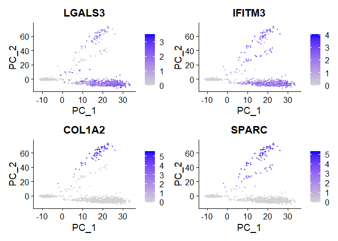
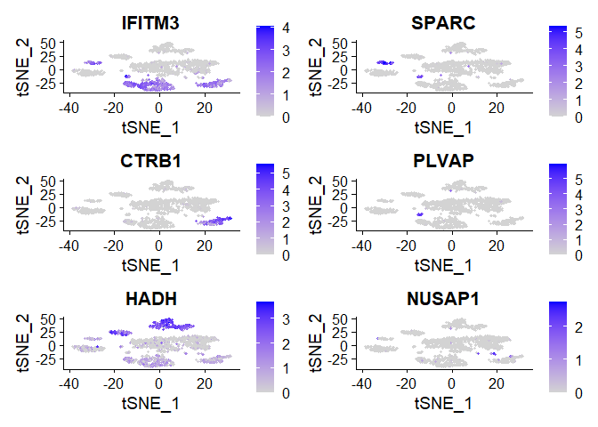

Dimensionality Reduction
================
Thomas Hollt

# Dimensionality Reduction & Visualization

In this tutorial we will look at different ways to visualize single cell
RNA-seq datasets using dimensionality reduction. We will apply the
Principal Component Analysis (PCA), t-distributed Stochastic Neighbor
Embedding (t-SNE) and Uniform Manifold Approximation and Projection
(UMAP) algorithms. Further, we will look at different ways to plot the
dimensionality reduced data and augment them with additional
information, such as gene expression or meta-information.

## Datasets

For this tutorial we will use a human pancreatic islet cell dataset part
of a combination of datasets available
[here](https://www.dropbox.com/s/1zxbn92y5du9pu0/pancreas_v3_files.tar.gz?dl=1).
For this tutorial the dateset is not of particular importance, as we
will be looking at general dimensionality reduction methods, rather than
specific biological findings. Therefore, we will also not look in detail
on the loading and preprocessing part. The following [Data
Integration](../session-integration/Data_Integration.md) lab will work
with the same datsets and cover this in more detail.

### Data preprocessing

Load required packages. Here, we will use the Seurat functions for the
dimensionality reduction. They are also available as pure R functions
but Seurat nicely packages them for our data. We will use ggplot for
creating the plots.

``` r
suppressMessages(require(Seurat))
suppressMessages(require(ggplot2))
```

### Data loading and preprocessing

Loading and preprocessing is based on, and covered in more detail in the
following [Data Integration](../session-integration/Data_Integration.md)
lab.

Load in expression matrix and metadata. The metadata file contains the
technology (`tech` column) and cell type annotations (`cell type`
column) for each cell in the four datasets. The data is assumed to be in
`~/scrna-seq2019/session-dimensionalityreduction/`. You can just change
this to your preferred location, if you do not want to copy the
data.

``` r
pancreas.data <- readRDS(file = "~/scrna-seq2019/session-dimensionalityreduction/pancreas_expression_matrix.rds")
metadata <- readRDS(file = "~/scrna-seq2019/session-dimensionalityreduction/pancreas_metadata.rds")
```

Create a Seurat object. This will create a data object with the original
matrix and the metadata combined.

``` r
pancreas <- CreateSeuratObject(pancreas.data, meta.data = metadata)
```

As there are four datasets, acquired with different technologies, we
separate the individual datasets into new Seurat objects, according to
the `tech` column of the metadata. We assign the fourth data object of
the resulting split list to the `smartseq2` object and free the other
memory.

Note: from here on we only use the `smartseq2` dataset to manage
computation time. You can pick any of the above or the combined.
`smartseq2` is the largest of the separated, so if you want to speed up
the workflow you can switch to the others. Check the `pancreas.list` for
the individual sizes. Make sure you do not remove the objects you want
to use.

``` r
# split the data by using the tech meta data
pancreas.list <- SplitObject(pancreas, split.by = "tech")

# you can use any subsets from the list. For the lab we continue with the smartseq2 data
# celseq <- pancreas.list[[1]]
# celseq2 <- pancreas.list[[2]]
# fluidigmc1 <- pancreas.list[[3]]
smartseq2 <- pancreas.list[[4]]

# Free up the memory
remove(pancreas.list)
remove(pancreas)
remove(pancreas.data)
gc()
```

    ##            used  (Mb) gc trigger   (Mb) limit (Mb)  max used   (Mb)
    ## Ncells  2115728 113.0    4026810  215.1         NA   3574801  191.0
    ## Vcells 48386400 369.2  204485336 1560.1      16384 212579742 1621.9

We perform standard preprocessing (log-normalization), identify variable
features based on a variance stabilizing transformation `vst`, and scale
the integrated data.

``` r
# Normalize and find variable features
smartseq2 <- NormalizeData(smartseq2, verbose = FALSE)
smartseq2 <- FindVariableFeatures(smartseq2, selection.method = "vst", nfeatures = 2000, verbose = FALSE)
    
# Run the standard workflow for visualization and clustering
smartseq2 <- ScaleData(smartseq2, verbose = FALSE)
```

## Dimensionality Reduction

From here on, we will have a look at the different dimensionality
reduction methods and their parameterizations.

### PCA

We start with PCA. Seurat provides the `RunPCA` function, we use
`smartseq2` as input data. `npcs` refers to the number of prinicpal
components to compute. We set it to `100.` This will take a bit longer
to compute but will allow use to explore the differences using different
numbers of PCs below. By assigning the result to our `smartseq2` data
object it wil lbe available in the object with the default name `pca`.

``` r
smartseq2 <- RunPCA(smartseq2, npcs = 100, verbose = FALSE)
```

We can now plot the first two components using the `DimPlot` function.
The first argument here is the Seurat data object `smartseq2`. By
providing the `Rreduction = "pca"` argument, `DimPlot` looks in the
object for the PCA we created and assigned above.

``` r
DimPlot(smartseq2, reduction = "pca")
```

<!-- -->

This plot shows some structure of the data. Every dot is a cell, but we
do not know which cells belong to which dot, etc. We can add meta
information by the `group.by` parameter. We use the `celltype` that we
have read from the metadata
object.

``` r
DimPlot(smartseq2, reduction = "pca", group.by = "celltype")
```

<!-- -->

We can see that only a few of the labelled cell-types separate well but
many are clumped together on the bottom of the plot.

Let’s have a look at the PCs to understand a bit better how PCA
separates the data. Using the `DimHeatmap` function, we can plot the
expression of the top genes for each PC for a number of cells. We will
plot the first six components `dims = 1:6` for 500 random cells `cells
= 500`. Each component will produce one heatmap, the cells will be the
columns in the heatmap and the top genes for each component the
rows.

``` r
DimHeatmap(smartseq2, dims = 1:6, cells = 500, balanced = TRUE)
```

<!-- -->

As discussed in the lecture, and indicated above, PCA is not optimal for
visualization, but can be very helpful in reducing the complexity before
applying non-linear dimensionality reduction methods. For that, let’s
have a look how many PCs actually cover the main vairation. A very
simple, fast-to-compute way is simply looking at the standard deviation
per PC. We use the
`ElbowPlot`.

``` r
ElbowPlot(smartseq2, ndims = 100)
```

<!-- -->

As we can see there is a very steep drop in standard deviation within
the first 20 or so PCs indicating that we will likelyl be able to use
roughly that number of PCs as input to follwing computations with little
impact on the results.

### t-SNE

Let’s try out t-SNE. Seurat by default uses the [Barnes Hut (BH) SNE
implementation](https://arxiv.org/abs/1301.3342).

Similar to the PCA Seurat provies a convenient function to run t-SNE
called `RunTSNE`. We provide the `smartseq2` data object as parameter.
By default `RunTSNE` will look for and use the PCA we created above as
input, we can also force it with `reduction = "pca"`. Again we use
`DimPlot` to plot the result, this time using `reduction = "tsne"` to
indicate that we want to plot the t-SNE computation. We create two
plots, the first without and the second with the cell-types used for
grouping. Already without the coloring, we can see much more structure
in the plot than in the PCA plot. With the color overlay we see that
most cell-types are nicely separated in the plot.

``` r
smartseq2 <- RunTSNE(smartseq2, reduction = "pca")

DimPlot(smartseq2, reduction = "tsne")
```

<!-- -->

``` r
DimPlot(smartseq2, reduction = "tsne", group.by = "celltype")
```

<!-- -->

Above we did not specify the number of PCs to use as input. Let’s have a
look what happens with different numbers of PCs as input. We simply run
`RunTSNE` multiple times with `dims` defining a range of PCs. *Note*
every run overwrites the `tsne` object nested in the `smartseq2` object.
Therefore we plot the tsne directly after each run and store all plots
in the `tsne_mult` list. We add `+ NoLegend() + ggtitle("n PCs")` to
remove the list of cell types for compactness and add a title.

``` r
# PC_1 to PC_5
smartseq2 <- RunTSNE(smartseq2, reduction = "pca", dims = 1:5)
tsne_mult <- list(DimPlot(smartseq2, reduction = "tsne", group.by = "celltype") + NoLegend() + ggtitle("5 PCs"))

# PC_1 to PC_10
smartseq2 <- RunTSNE(smartseq2, reduction = "pca", dims = 1:10)
tsne_mult[[2]] <- DimPlot(smartseq2, reduction = "tsne", group.by = "celltype") + NoLegend() + ggtitle("10 PCs")

# PC_1 to PC_30
smartseq2 <- RunTSNE(smartseq2, reduction = "pca", dims = 1:30)
tsne_mult[[3]] <- DimPlot(smartseq2, reduction = "tsne", group.by = "celltype") + NoLegend() + ggtitle("30 PCs")

# PC_1 to PC_100
smartseq2 <- RunTSNE(smartseq2, reduction = "pca", dims = 1:100)
tsne_mult[[4]] <- DimPlot(smartseq2, reduction = "tsne", group.by = "celltype") + NoLegend() + ggtitle("100 PCs")

CombinePlots(plots = tsne_mult)
```

<!-- -->

Looking at these plots, it seems `RunTSNE` by default only uses 5 PCs
(the plot is identical to the plot with default parameters above), but
we get much clearer separation of clusters using 10 or even 30 PCs. This
is not surprising considering the plot above of the standard deviation
within the PCs above. Therefore we will use 30 PCs in the following, by
explicitly setting `dims = 1:30`. *Note* that t-SNE is slower with more
input dimensions (here the PCs), so it is good to find a middleground
between capturing as much variation as possible with as few PCs as
possible. However, using the default 5 does clearly not produce optimal
results for this dataset. When using t-SNE with PCA preprocessing with
your own data, always check how many PCs you need to cover the variance,
as done above.

t-SNE has a few hyper-parameters that can be tuned for better
visualization. There is an [excellent
tutorial](https://distill.pub/2016/misread-tsne/). The main parameter is
the perplexity, basically indicating how many neighbors to look at. We
will run different perplexities to see the effect. As we will see, a
perplexity of 30 is the default. This value often works well, again it
might be advisable to test different values with other data. *Note*,
higher perplexity values make t-SNE slower to compute.

``` r
# Perplexity 3
smartseq2 <- RunTSNE(smartseq2, reduction = "pca", dims = 1:30, perplexity = 3)
tsne_mult <- list(DimPlot(smartseq2, reduction = "tsne", group.by = "celltype") + NoLegend() + ggtitle("30PCs, Perplexity 3"))

# Perplexity 10
smartseq2 <- RunTSNE(smartseq2, reduction = "pca", dims = 1:30, perplexity = 10)
tsne_mult[[2]] <- DimPlot(smartseq2, reduction = "tsne", group.by = "celltype") + NoLegend() + ggtitle("30PCs, Perplexity 10")

# Perplexity 30
smartseq2 <- RunTSNE(smartseq2, reduction = "pca", dims = 1:30, perplexity = 30)
tsne_mult[[3]] <- DimPlot(smartseq2, reduction = "tsne", group.by = "celltype") + NoLegend() + ggtitle("30PCs, Perplexity 30")

# Perplexity 200
smartseq2 <- RunTSNE(smartseq2, reduction = "pca", dims = 1:30, perplexity = 200)
tsne_mult[[4]] <- DimPlot(smartseq2, reduction = "tsne", group.by = "celltype") + NoLegend() + ggtitle("30PCs, Perplexity 200")

CombinePlots(plots = tsne_mult)
```

<!-- -->

Another important parameter is the number of iterations. t-SNE gradually
optimizes the low-dimensional space. The more iterations the more there
is to optimize. We will run different numbers of iterations to see the
effect. As we will see, 1000 iterations is the default. This value often
works well, again it might be advisable to test different values with
other data. Especially for larger datasets you will need more
iterations. *Note*, more iterations make t-SNE slower to compute.

``` r
# 100 iterations
smartseq2 <- RunTSNE(smartseq2, reduction = "pca", dims = 1:30, max_iter = 100)
tsne_mult <- list(DimPlot(smartseq2, reduction = "tsne", group.by = "celltype") + NoLegend() + ggtitle("100 iterations"))

# 500 iterations
smartseq2 <- RunTSNE(smartseq2, reduction = "pca", dims = 1:30, max_iter = 500)
tsne_mult[[2]] <- DimPlot(smartseq2, reduction = "tsne", group.by = "celltype") + NoLegend() + ggtitle("500 iterations")

# 1000 iterations
smartseq2 <- RunTSNE(smartseq2, reduction = "pca", dims = 1:30, max_iter = 1000)
tsne_mult[[3]] <- DimPlot(smartseq2, reduction = "tsne", group.by = "celltype") + NoLegend() + ggtitle("1000 iterations")

# 2000 iterations
smartseq2 <- RunTSNE(smartseq2, reduction = "pca", dims = 1:30, max_iter = 2000)
tsne_mult[[4]] <- DimPlot(smartseq2, reduction = "tsne", group.by = "celltype") + NoLegend() + ggtitle("2000 iterations")

CombinePlots(plots = tsne_mult)
```

<!-- -->

As we see after 100 iterations the main structure becomes apparent, but
there is very little detail. 500 to 2000 iterations all look very
similar, with 500 still a bit more loose than 1000, indicating that the
optimization converges somewhere between 500 and 1000 iterations. In
this case running 2000 would definitely not necessary.

### UMAP

We have seen t-SNE and it’s main parameters. Let’s have a look at UMAP.
Its main function call is very similar to t-SNE and PCA and called
`RunUMAP`. Again, by default it looks for the PCA in the `smartseq2`
data object, but we have to provide it with the number of PCs (or
`dims`) to use. Here, we use `30`. As expected, the plot looks rather
similar to the t-SNE plot, with more compact
    clusters.

``` r
smartseq2 <- RunUMAP(smartseq2, dims = 1:30)

DimPlot(smartseq2, reduction = "umap", group.by = "celltype")
```

<!-- -->

Just like t-SNE UMAP has a bunch of parameters. In fact, Seurat exposes
wuite a few more than for t-SNE. We will look at the most important in
the following. While there is no site that systematically and
interactively explores them as for t-SNE there is a [comparison with the
same datasets
available](https://jlmelville.github.io/uwot/umap-simple.html).

Again, we start with a different number of PCs. similar to t-SNE, 5 is
clearly not enough, 30 provides decent separation and detail. Just like
for t-SNE, test this parameter to match your own data in real-world
experiments.

``` r
# PC_1 to PC_5
smartseq2 <- RunUMAP(smartseq2, dims = 1:5)

umap_mult <- list(DimPlot(smartseq2, reduction = "umap", group.by = "celltype") + NoLegend() + ggtitle("5 PCs"))

# PC_1 to PC_10
smartseq2 <- RunUMAP(smartseq2, dims = 1:10)

umap_mult[[2]] <- DimPlot(smartseq2, reduction = "umap", group.by = "celltype") + NoLegend() + ggtitle("10 PCs")

# PC_1 to PC_30
smartseq2 <- RunUMAP(smartseq2, dims = 1:30)

umap_mult[[3]] <- DimPlot(smartseq2, reduction = "umap", group.by = "celltype") + NoLegend() + ggtitle("30 PCs")

# PC_1 to PC_100
smartseq2 <- RunUMAP(smartseq2, dims = 1:100)

umap_mult[[4]] <- DimPlot(smartseq2, reduction = "umap", group.by = "celltype") + NoLegend() + ggtitle("100 PCs")

CombinePlots(plots = umap_mult)
```

<!-- -->

The `n.neighbors` parameter sets the number of neighbors to consider for
UMAP. This parameter is similar to the perplexity in t-SNE. We try a
similar range of values for comparison. The results are quite similar to
t-SNE. with low values, clearly the structures are too spread out, but
quickly the embeddings become quite stable. The default vaule for
RunUMAP is 30. Similar to t-SNE this value is quite general. Again, it’s
always a good idea to run some test with new data to find a good value.

``` r
# 3 Neighbors
smartseq2 <- RunUMAP(smartseq2, dims = 1:30, n.neighbors = 3)

umap_mult <- list(DimPlot(smartseq2, reduction = "umap", group.by = "celltype") + NoLegend() + ggtitle("3 Neighbors"))

# 10 Neighbors
smartseq2 <- RunUMAP(smartseq2, dims = 1:30, n.neighbors = 10)

umap_mult[[2]] <- DimPlot(smartseq2, reduction = "umap", group.by = "celltype") + NoLegend() + ggtitle("10 Neighbors")

# 30 Neighbors
smartseq2 <- RunUMAP(smartseq2, dims = 1:30, n.neighbors = 30)

umap_mult[[3]] <- DimPlot(smartseq2, reduction = "umap", group.by = "celltype") + NoLegend() + ggtitle("30 Neighbors")

# 200 Neighbors
smartseq2 <- RunUMAP(smartseq2, dims = 1:30, n.neighbors = 200)

umap_mult[[4]] <- DimPlot(smartseq2, reduction = "umap", group.by = "celltype") + NoLegend() + ggtitle("200 Neighbors")

CombinePlots(plots = umap_mult)
```

<!-- -->

Another parameter is `min.dist`. There is no directly comparable
parameter in t-SNE. Generally, `min.dist` defines the compactnes of the
final embedding. The default value is 0.3.

``` r
# Min Distance 0.01
smartseq2 <- RunUMAP(smartseq2, dims = 1:30, min.dist = 0.01)

umap_mult <- list(DimPlot(smartseq2, reduction = "umap", group.by = "celltype") + NoLegend() + ggtitle("Min Dist 0.01"))

# Min Distance 0.1
smartseq2 <- RunUMAP(smartseq2, dims = 1:30, min.dist = 0.1)

umap_mult[[2]] <- DimPlot(smartseq2, reduction = "umap", group.by = "celltype") + NoLegend() + ggtitle("Min Dist 0.1")

# Min Distance 0.3
smartseq2 <- RunUMAP(smartseq2, dims = 1:30, min.dist = 0.3)

umap_mult[[3]] <- DimPlot(smartseq2, reduction = "umap", group.by = "celltype") + NoLegend() + ggtitle("Min Dist 0.3")

# Min Distance 1.0
smartseq2 <- RunUMAP(smartseq2, dims = 1:30, min.dist = 1.0)

umap_mult[[4]] <- DimPlot(smartseq2, reduction = "umap", group.by = "celltype") + NoLegend() + ggtitle("Min Dist 1.0")

CombinePlots(plots = umap_mult)
```

<!-- -->

n.epochs is comparable to the number of iterations in t-SNE. Typically,
UMAP needs fewer of these to converge, but also changes more when it is
run longer. The default is 500. Again, this should be adjusted to your
data.

``` r
# 10 epochs
smartseq2 <- RunUMAP(smartseq2, dims = 1:30, n.epochs = 10)

umap_mult <- list(DimPlot(smartseq2, reduction = "umap", group.by = "celltype") + NoLegend() + ggtitle("10 Epochs"))

# 100 epochs
smartseq2 <- RunUMAP(smartseq2, dims = 1:30, n.epochs = 100)

umap_mult[[2]] <- DimPlot(smartseq2, reduction = "umap", group.by = "celltype") + NoLegend() + ggtitle("100 Epochs")

# 500 epochs
smartseq2 <- RunUMAP(smartseq2, dims = 1:30, n.epochs = 500)

umap_mult[[3]] <- DimPlot(smartseq2, reduction = "umap", group.by = "celltype") + NoLegend() + ggtitle("500 Epochs")

# 1000 epochs
smartseq2 <- RunUMAP(smartseq2, dims = 1:30, n.epochs = 1000)

umap_mult[[4]] <- DimPlot(smartseq2, reduction = "umap", group.by = "celltype") + NoLegend() + ggtitle("1000 Epochs")

CombinePlots(plots = umap_mult)
```

<!-- -->

Finally `RunUMAP` allows to set the distance metric for the
high-dimensional space. While in principle this is also possible with
t-SNE, `RunTSNE`, and most other implementations, do not provide this
option. The four posibilites, `Euclidean`, `cosine`, `manhattan`, and
`hamming` distance are shown below. `Cosine` distance is the default
(RunTSNE uses Euclidean distances).

There is not necesarily a clear winner. Hamming distances perfom worse
but they are usually used for different data, such as text as they
ignore the numerical difference for a given comparison. Going with the
dafualt cosine is definitely not a bad choice in most applications.

``` r
# Euclidena distance
smartseq2 <- RunUMAP(smartseq2, dims = 1:30, metric = "euclidean")

umap_mult <- list(DimPlot(smartseq2, reduction = "umap", group.by = "celltype") + NoLegend() + ggtitle("Euclidean"))

# Cosine distance
smartseq2 <- RunUMAP(smartseq2, dims = 1:30, metric = "cosine")

umap_mult[[2]] <- DimPlot(smartseq2, reduction = "umap", group.by = "celltype") + NoLegend() + ggtitle("Cosine")

# Manhattan distance
smartseq2 <- RunUMAP(smartseq2, dims = 1:30, metric = "manhattan")

umap_mult[[3]] <- DimPlot(smartseq2, reduction = "umap", group.by = "celltype") + NoLegend() + ggtitle("Manhattan")

# Hamming distance
smartseq2 <- RunUMAP(smartseq2, dims = 1:30, metric = "hamming")

umap_mult[[4]] <- DimPlot(smartseq2, reduction = "umap", group.by = "celltype") + NoLegend() + ggtitle("Hamming")

CombinePlots(plots = umap_mult)
```

<!-- -->

## Visualization

Finally, let’s have a brief look at some visualization options. We have
already use color gor gouping. With `label = TRUE` we can add a
text-label to each group and with `repel = TRUE` we can make sure those
labels dont clump together. Finally, `pt.size = 0.5` changes the size of
the dots used in the plot.

``` r
#Re-run a t-SNE so we do not rely on changes above
smartseq2 <- RunTSNE(smartseq2, dims = 1:30)

DimPlot(smartseq2, reduction = "tsne", group.by = "celltype", label = TRUE, repel = TRUE, pt.size = 0.5) + NoLegend()
```

    ## Warning: Using `as.character()` on a quosure is deprecated as of rlang 0.3.0.
    ## Please use `as_label()` or `as_name()` instead.
    ## This warning is displayed once per session.

<!-- -->

Another property we might want to look at in our dimensionality
reduction plot is the expression of individual Genes. We can overlay
gene expression as color using the `FeaturePlot`. Here, we first find
the *top two* features correlated to the *first and second PCs* and
combine them into a single vector which will be the parameter for the
`FeaturePlot`.

Finally, we call `FeaturePlot` with the `smartseq2` data object,
`features = topFeaturesPC` uses the extracted feature vector to create
one plot for each feature in the list and lastly, `reduction = "pca"`
will create PCA plots.

Not surprisingly, the top two features of the first PC form a smooth
gradient on the PC\_1 axis and the top two features of the second PC a
smooth gradient on the PC\_2 axis.

``` r
# find top genes for PCs 1 and 2
topFeaturesPC1 <- TopFeatures(object = smartseq2[["pca"]], nfeatures = 2, dim = 1)
topFeaturesPC2 <- TopFeatures(object = smartseq2[["pca"]], nfeatures = 2, dim = 2)

# combine the genes into a single vector
topFeaturesPC <- c(topFeaturesPC1, topFeaturesPC2)
print(topFeaturesPC)
```

    ## [1] "LGALS3" "IFITM3" "COL1A2" "SPARC"

``` r
# feature plot with the defined genes
FeaturePlot(smartseq2, features = topFeaturesPC, reduction = "pca")
```

<!-- -->

Let’s have a look at the same features on a t-SNE plot. The bahvior here
is quite different, with the high expression being very localized to
specific clusters in the maps. Again, not surprising as t-SNE uses
these

``` r
FeaturePlot(smartseq2, features = topFeaturesPC, reduction = "tsne")
```

<!-- -->

It is clear that the top PCs are fundamental to forming the clusters, so
let’s have a look at more PCs and pick the top gene per PC for a few
more PCs.

``` r
for(i in 1:6) {
  topFeaturesPC[[i]] <- TopFeatures(object = smartseq2[["pca"]], nfeatures = 1, dim = i)
}
print(topFeaturesPC)
```

    ## [1] "IFITM3" "SPARC"  "CTRB1"  "PLVAP"  "HADH"   "NUSAP1"

``` r
FeaturePlot(smartseq2, features = topFeaturesPC, reduction = "tsne")
```

<!-- -->

Finally, let’s create a more interactive plot. First we create a regular
`FeaturePlot`, here with just one gene `features = "TM4SF4"`. Instead of
plotting in directly we save the plot in the `interactivePlot` variable.

With `HoverLocator` we can then embedd this plot into an interactive
version. The `information = FetchData(smartseq2, vars = c("celltype",
topFeaturesPC))` creates a set of properties that will be shown on hover
over each point. Im this case, we show the cell-type from the meta
information.

The result is a plot that allows us to inspect single cells in
detail.

``` r
interactivePlot <- FeaturePlot(smartseq2, reduction = "tsne", features = "TM4SF4")

HoverLocator(plot = interactivePlot, information = FetchData(smartseq2, vars = c("celltype", topFeaturesPC)))
```

Note the interactive plot does not work in the github file.