Quality Control and Normalization
================

Created by: Ahmed Mahfouz

# Overview

In this practical, we will walk through a pipeline to analyze single
cell RNA-sequencing (scRNA-seq) data. Starting from a count matrix, we
will cover the following steps of the analysis: 1. Quality control 2.
Normalization 3. Feature selection

## Datasets

For this tutorial we will use 3 different PBMC datasets from the 10x
Genomics website
(<https://support.10xgenomics.com/single-cell-gene-expression/datasets>).

* 1k PBMCs using 10x v2 chemistry 
* 1k PBMCs using 10x v3 chemistry 
* 1k PBMCs using 10x v3 chemistry in combination with cell surface proteins, but disregarding the protein data and only looking at gene expression.

The datasets are available in this repository. 

Load required packages:

``` r
suppressMessages(require(Seurat))
suppressMessages(require(scater))
suppressMessages(require(scran))
suppressMessages(require(Matrix))
```

## Read the data and create a Seurat object

Here, we use the function Read10X\_h5 to read in the expression matrices
in R.

``` r
v3.1k <- Read10X_h5("pbmc_1k_v3_filtered_feature_bc_matrix.h5", use.names = T)
v2.1k <- Read10X_h5("pbmc_1k_v2_filtered_feature_bc_matrix.h5", use.names = T)
p3.1k <- Read10X_h5("pbmc_1k_protein_v3_filtered_feature_bc_matrix.h5", use.names = T)
```

    ## Genome matrix has multiple modalities, returning a list of matrices for this genome

``` r
# select only gene expression data from the CITE-seq data.
p3.1k <- p3.1k$`Gene Expression`
```

First, create Seurat objects for each of the datasets, and then merge
into one large seurat object.

``` r
sdata.v2.1k <- CreateSeuratObject(v2.1k, project = "v2.1k")
sdata.v3.1k <- CreateSeuratObject(v3.1k, project = "v3.1k")
sdata.p3.1k <- CreateSeuratObject(p3.1k, project = "p3.1k")

# merge into one single seurat object. Add cell ids just in case you have overlapping barcodes between the datasets.
alldata <- merge(sdata.v2.1k, c(sdata.v3.1k,sdata.p3.1k), add.cell.ids=c("v2.1k","v3.1k","p3.1k"))

# also add in a metadata column that indicates v2 vs v3 chemistry
chemistry <- rep("v3",ncol(alldata))
chemistry[Idents(alldata) == "v2.1k"] <- "v2"
alldata <- AddMetaData(alldata, chemistry, col.name = "Chemistry")
alldata
```

    ## An object of class Seurat 
    ## 33538 features across 2931 samples within 1 assay 
    ## Active assay: RNA (33538 features)

Check number of cells from each sample, is stored in the orig.ident slot
of metadata and is autmatically set as active ident.

``` r
table(Idents(alldata))
```

    ## 
    ## p3.1k v2.1k v3.1k 
    ##   713   996  1222

## 1\. Quality control

Seurat automatically calculates some QC-stats, like number of UMIs and
features per cell. Stored in columns nCount\_RNA & nFeature\_RNA of the
metadata.

``` r
head(alldata@meta.data)
```

    ##                          orig.ident nCount_RNA nFeature_RNA Chemistry
    ## v2.1k_AAACCTGAGCGCTCCA-1      v2.1k       6631         2029        v2
    ## v2.1k_AAACCTGGTGATAAAC-1      v2.1k       2196          881        v2
    ## v2.1k_AAACGGGGTTTGTGTG-1      v2.1k       2700          791        v2
    ## v2.1k_AAAGATGAGTACTTGC-1      v2.1k       3551         1183        v2
    ## v2.1k_AAAGCAAGTCTCTTAT-1      v2.1k       3080         1333        v2
    ## v2.1k_AAAGCAATCCACGAAT-1      v2.1k       5769         1556        v2

### Calculate mitochondrial proportion

We will manually calculate the proportion of mitochondrial reads and add
to the metadata table.

``` r
mt.genes <- rownames(alldata)[grep("^MT-",rownames(alldata))]
C <- GetAssayData(object = alldata, slot = "counts")

percent.mito <- colSums(C[mt.genes,])/Matrix::colSums(C)*100
alldata <- AddMetaData(alldata, percent.mito, col.name = "percent.mito")
```

#### Calculate ribosomal proportion

In the same manner we will calculate the proportion gene expression that
comes from ribosomal proteins.

``` r
rb.genes <- rownames(alldata)[grep("^RP[SL]",rownames(alldata))]
percent.ribo <- colSums(C[rb.genes,])/Matrix::colSums(C)*100
alldata <- AddMetaData(alldata, percent.ribo, col.name = "percent.ribo")
```

Now have another look at the metadata table

``` r
head(alldata@meta.data)
```

    ##                          orig.ident nCount_RNA nFeature_RNA Chemistry
    ## v2.1k_AAACCTGAGCGCTCCA-1      v2.1k       6631         2029        v2
    ## v2.1k_AAACCTGGTGATAAAC-1      v2.1k       2196          881        v2
    ## v2.1k_AAACGGGGTTTGTGTG-1      v2.1k       2700          791        v2
    ## v2.1k_AAAGATGAGTACTTGC-1      v2.1k       3551         1183        v2
    ## v2.1k_AAAGCAAGTCTCTTAT-1      v2.1k       3080         1333        v2
    ## v2.1k_AAAGCAATCCACGAAT-1      v2.1k       5769         1556        v2
    ##                          percent.mito percent.ribo
    ## v2.1k_AAACCTGAGCGCTCCA-1     5.172674     25.84829
    ## v2.1k_AAACCTGGTGATAAAC-1     4.143898     20.81056
    ## v2.1k_AAACGGGGTTTGTGTG-1     3.296296     51.55556
    ## v2.1k_AAAGATGAGTACTTGC-1     5.885666     29.25936
    ## v2.1k_AAAGCAAGTCTCTTAT-1     2.987013     17.53247
    ## v2.1k_AAAGCAATCCACGAAT-1     2.010747     45.69249

#### Plot QC

Now we can plot some of the QC-features as violin plots

``` r
VlnPlot(alldata, features = "nFeature_RNA", pt.size = 0.1) + NoLegend()
```

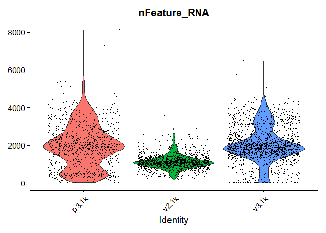<!-- -->

``` r
VlnPlot(alldata, features = "nCount_RNA", pt.size = 0.1) + NoLegend()
```

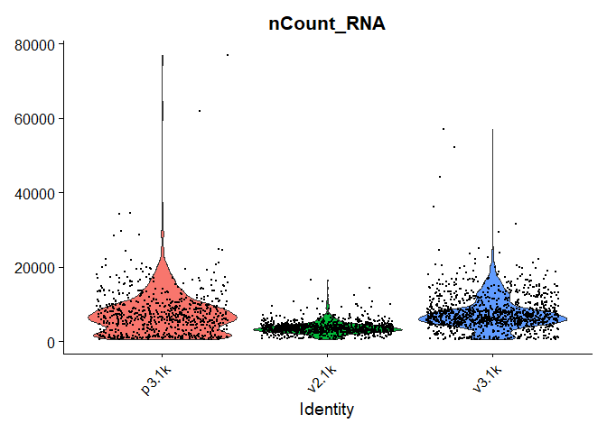<!-- -->

``` r
VlnPlot(alldata, features = "percent.mito", pt.size = 0.1) + NoLegend()
```

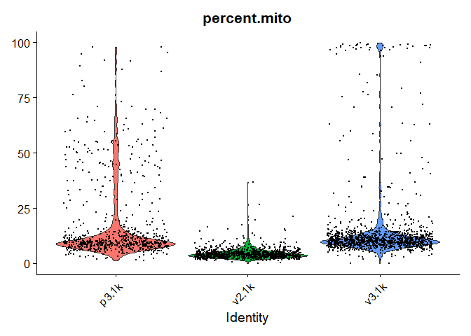<!-- -->

``` r
VlnPlot(alldata, features = "percent.ribo", pt.size = 0.1) + NoLegend()
```

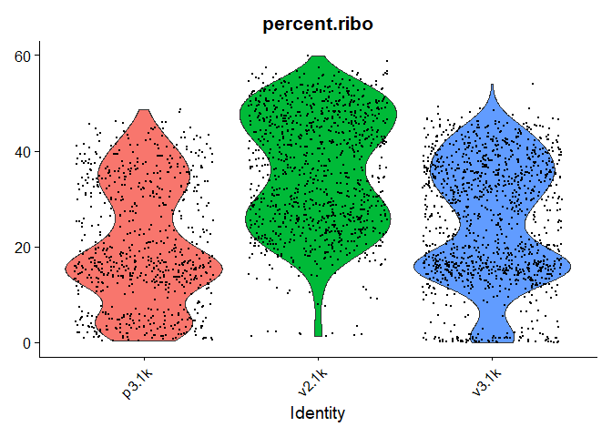<!-- -->

As you can see, the v2 chemistry gives lower gene detection, but higher
detection of ribosomal proteins. As the ribosomal proteins are highly
expressed they will make up a larger proportion of the transcriptional
landscape when fewer of the lowly expressed genes are detected.

We can also plot the different QC-measures as scatter plots.

``` r
FeatureScatter(alldata, feature1 = "nCount_RNA", feature2 = "nFeature_RNA")
```

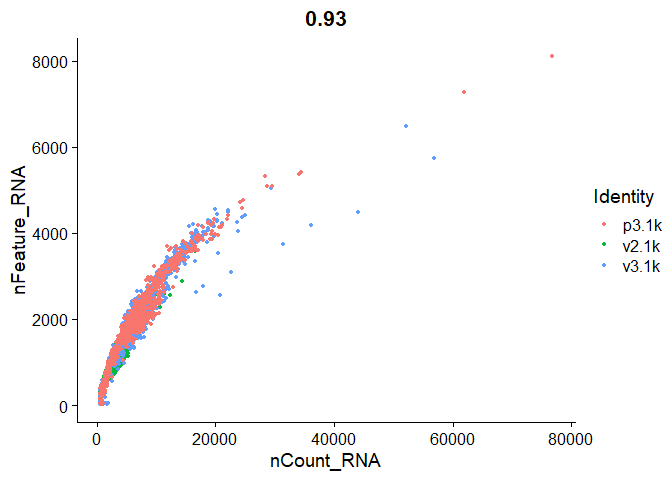<!-- -->

``` r
FeatureScatter(alldata, feature1 = "nFeature_RNA", feature2 = "percent.mito")
```

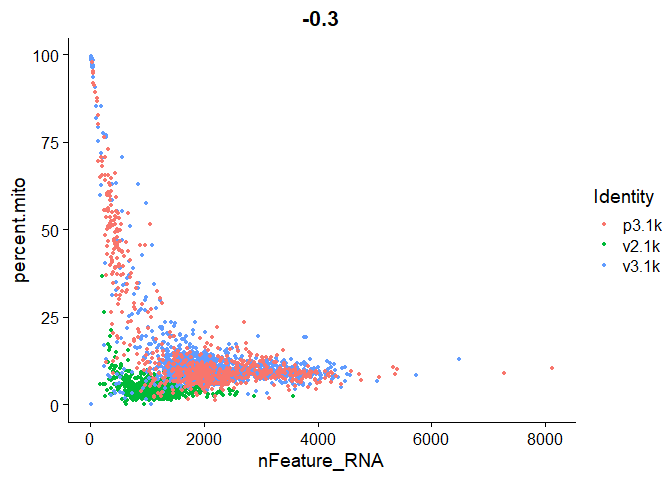<!-- -->

``` r
FeatureScatter(alldata, feature1="percent.ribo", feature2="nFeature_RNA")
```

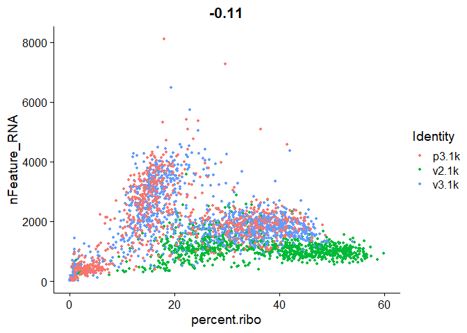<!-- -->

We can also subset the data to only plot one sample.

``` r
FeatureScatter(alldata, feature1 = "nCount_RNA", feature2 = "nFeature_RNA", 
               cells = WhichCells(alldata, expression = orig.ident == "v3.1k") )
```

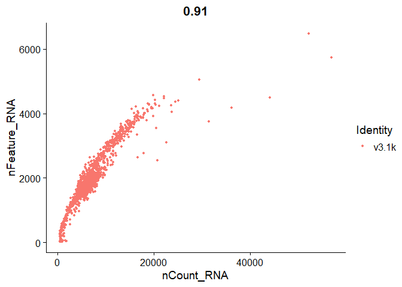<!-- -->

### Filtering

#### Mitochondrial filtering

We have quite a lot of cells with high proportion of mitochondrial
reads. It could be wise to remove those cells, if we have enough cells
left after filtering. Another option would be to either remove all
mitochondrial reads from the dataset and hope that the remaining genes
still have enough biological signal. A third option would be to just
regress out the percent.mito variable during scaling.

In this case we have as much as 99.7% mitochondrial reads in some of the
cells, so it is quite unlikely that there is much celltype signature
left in those.

Looking at the plots, make resonable decisions on where to draw the
cutoff. In this case, the bulk of the cells are below 25% mitochondrial
reads and that will be used as a cutoff.

``` r
#select cells with percent.mito < 25
selected <- WhichCells(alldata, expression = percent.mito < 25)
length(selected)
```

    ## [1] 2703

``` r
# and subset the object to only keep those cells
data.filt <- subset(alldata, cells = selected)

# plot violins for new data
VlnPlot(data.filt, features = "percent.mito")
```

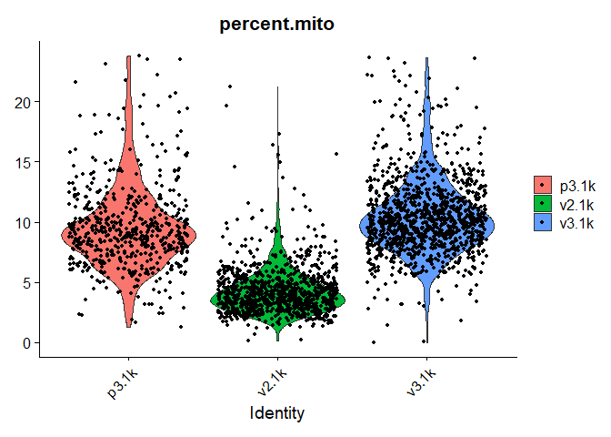<!-- -->

As you can see, there is still quite a lot of variation in percent mito,
so it will have to be dealt with in the data analysis step.

#### Gene detection filtering

Extremely high number of detected genes could indicate doublets.
However, depending on the celltype composition in your sample, you may
have cells with higher number of genes (and also higher counts) from one
celltype.

In these datasets, there is also a clear difference between the v2 vs v3
10x chemistry with regards to gene detection, so it may not be fair to
apply the same cutoffs to all of them.

Also, in the protein assay data there is a lot of cells with few
detected genes giving a bimodal distribution. This type of distribution
is not seen in the other 2 datasets. Considering that they are all pbmc
datasets it makes sense to regard this distribution as low quality
libraries.

Filter the cells with high gene detection (putative doublets) with
cutoffs 4100 for v3 chemistry and 2000 for v2.

``` r
#start with cells with many genes detected.
high.det.v3 <- WhichCells(data.filt, expression = nFeature_RNA > 4100)
high.det.v2 <- WhichCells(data.filt, expression = nFeature_RNA > 2000 & orig.ident == "v2.1k")

# remove these cells
data.filt <- subset(data.filt, cells=setdiff(WhichCells(data.filt),c(high.det.v2,high.det.v3)))

# check number of cells
ncol(data.filt)
```

    ## [1] 2631

Filter the cells with low gene detection (low quality libraries) with
less than 1000 genes for v2 and \< 500 for v2.

``` r
#start with cells with many genes detected.
low.det.v3 <- WhichCells(data.filt, expression = nFeature_RNA < 1000 & orig.ident != "v2.1k")
low.det.v2 <- WhichCells(data.filt, expression = nFeature_RNA < 500 & orig.ident == "v2.1k")

# remove these cells
data.filt <- subset(data.filt, cells=setdiff(WhichCells(data.filt),c(low.det.v2,low.det.v3)))

# check number of cells
ncol(data.filt)
```

    ## [1] 2531

#### Plot QC-stats again

Lets plot the same qc-stats another time.

``` r
VlnPlot(data.filt, features = "nFeature_RNA", pt.size = 0.1) + NoLegend()
```

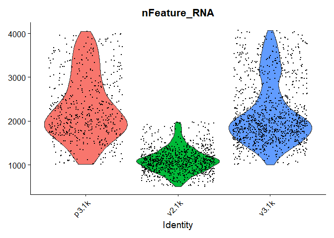<!-- -->

``` r
VlnPlot(data.filt, features = "nCount_RNA", pt.size = 0.1) + NoLegend()
```

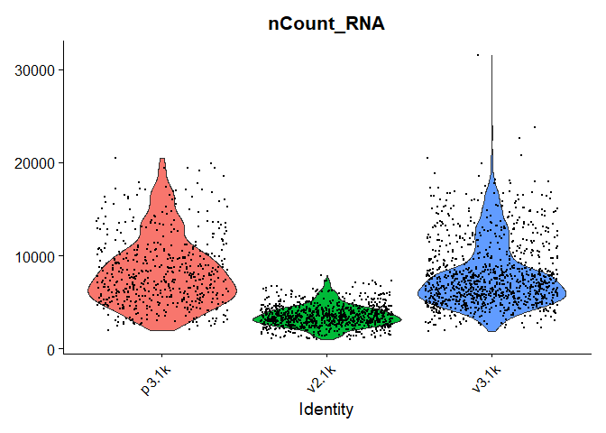<!-- -->

``` r
VlnPlot(data.filt, features = "percent.mito", pt.size = 0.1) + NoLegend()
```

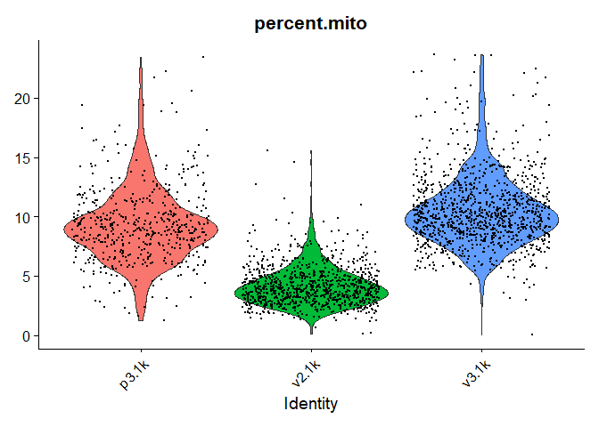<!-- -->

``` r
VlnPlot(data.filt, features = "percent.ribo", pt.size = 0.1) + NoLegend()
```

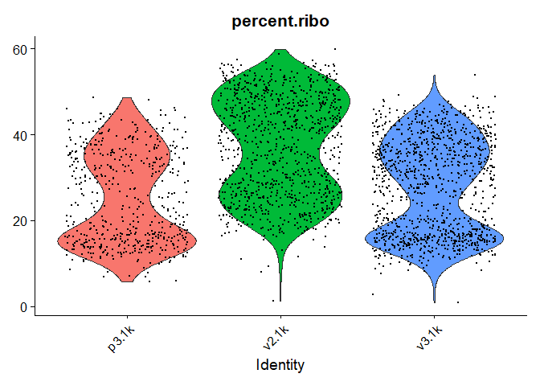<!-- -->

``` r
# and check the number of cells per sample before and after filtering
table(Idents(alldata))
```

    ## 
    ## p3.1k v2.1k v3.1k 
    ##   713   996  1222

``` r
table(Idents(data.filt))
```

    ## 
    ## p3.1k v2.1k v3.1k 
    ##   526   933  1072

### Calculate cell-cycle scores

Seurat has a function for calculating cell cycle scores based on a list
of know S-phase and G2/M-phase genes.

``` r
data.filt <- CellCycleScoring(
  object = data.filt,
  g2m.features = cc.genes$g2m.genes,
  s.features = cc.genes$s.genes
)

VlnPlot(data.filt, features = c("S.Score","G2M.Score"))
```

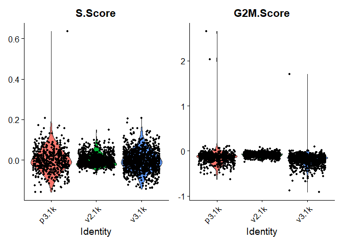<!-- -->

In this case it looks like we only have a few cycling cells in the
datasets.

## 2\. Normalization

``` r
options(stringsAsFactors = FALSE)
set.seed(32546)
```

To speed things up, we will continue working with the v3.1k dataset
only. We will convert the Seurat object to a SCE object to work with the
scater package. You can read more about SCE objects
[here](https://osca.bioconductor.org/data-infrastructure.html#the-singlecellexperiment-class).

Note: to create an SCE object directly from the count matrices, have a
look at their tutorial at:
<https://bioconductor.org/packages/release/bioc/vignettes/scater/inst/doc/vignette-intro.html>.

``` r
pbmc.sce <- SingleCellExperiment(assays = list(counts = as.matrix(v3.1k)))
pbmc.sce <- pbmc.sce[rowSums(counts(pbmc.sce) > 0) > 2,]
isSpike(pbmc.sce, "MT") <- grepl("^MT-", rownames(pbmc.sce))
pbmc.sce <- calculateQCMetrics(pbmc.sce)
colnames(colData(pbmc.sce))
```

    ##  [1] "is_cell_control"                               
    ##  [2] "total_features_by_counts"                      
    ##  [3] "log10_total_features_by_counts"                
    ##  [4] "total_counts"                                  
    ##  [5] "log10_total_counts"                            
    ##  [6] "pct_counts_in_top_50_features"                 
    ##  [7] "pct_counts_in_top_100_features"                
    ##  [8] "pct_counts_in_top_200_features"                
    ##  [9] "pct_counts_in_top_500_features"                
    ## [10] "total_features_by_counts_endogenous"           
    ## [11] "log10_total_features_by_counts_endogenous"     
    ## [12] "total_counts_endogenous"                       
    ## [13] "log10_total_counts_endogenous"                 
    ## [14] "pct_counts_endogenous"                         
    ## [15] "pct_counts_in_top_50_features_endogenous"      
    ## [16] "pct_counts_in_top_100_features_endogenous"     
    ## [17] "pct_counts_in_top_200_features_endogenous"     
    ## [18] "pct_counts_in_top_500_features_endogenous"     
    ## [19] "total_features_by_counts_feature_control"      
    ## [20] "log10_total_features_by_counts_feature_control"
    ## [21] "total_counts_feature_control"                  
    ## [22] "log10_total_counts_feature_control"            
    ## [23] "pct_counts_feature_control"                    
    ## [24] "pct_counts_in_top_50_features_feature_control" 
    ## [25] "pct_counts_in_top_100_features_feature_control"
    ## [26] "pct_counts_in_top_200_features_feature_control"
    ## [27] "pct_counts_in_top_500_features_feature_control"
    ## [28] "total_features_by_counts_MT"                   
    ## [29] "log10_total_features_by_counts_MT"             
    ## [30] "total_counts_MT"                               
    ## [31] "log10_total_counts_MT"                         
    ## [32] "pct_counts_MT"                                 
    ## [33] "pct_counts_in_top_50_features_MT"              
    ## [34] "pct_counts_in_top_100_features_MT"             
    ## [35] "pct_counts_in_top_200_features_MT"             
    ## [36] "pct_counts_in_top_500_features_MT"

Filter out poor quality cells to avoid negative size factors. These
steps are very similar to what we have already done on the combined
Seurat object but now we perform them on one dataset only using the
Scater package.

``` r
pbmc.sce <- filter(pbmc.sce, pct_counts_MT < 20)
pbmc.sce <- filter(pbmc.sce, 
                   total_features_by_counts > 1000 & 
                     total_features_by_counts < 4100)
```

Create a new assay with unnormalized counts for comparison to
post-normalization.

``` r
assay(pbmc.sce, "logcounts_raw") <- log2(counts(pbmc.sce) + 1)
plotRLE(pbmc.sce[,1:50], exprs_values = "logcounts_raw", style = "full")
```

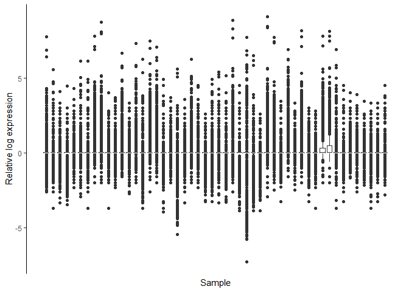<!-- -->

Run PCA and save the result in a new object, as we will overwrite the
PCA slot later.

``` r
raw.sce <- runPCA(pbmc.sce, exprs_values = "logcounts_raw")
scater::plotPCA(raw.sce, colour_by = "total_counts")
```

    ## Warning: 'add_ticks' is deprecated.
    ## Use '+ geom_rug(...)' instead.

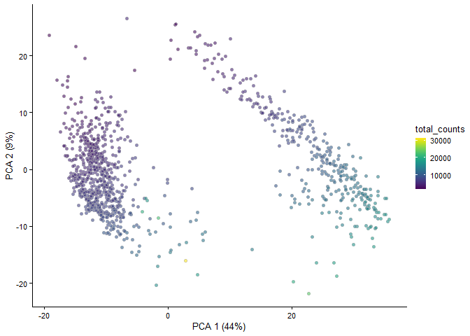<!-- -->

Plot the expression of the B cell marker MS4A1.

``` r
plotReducedDim(raw.sce, use_dimred = "PCA", by_exprs_values = "logcounts_raw",
               colour_by = "MS4A1")
```

    ## Warning: 'add_ticks' is deprecated.
    ## Use '+ geom_rug(...)' instead.

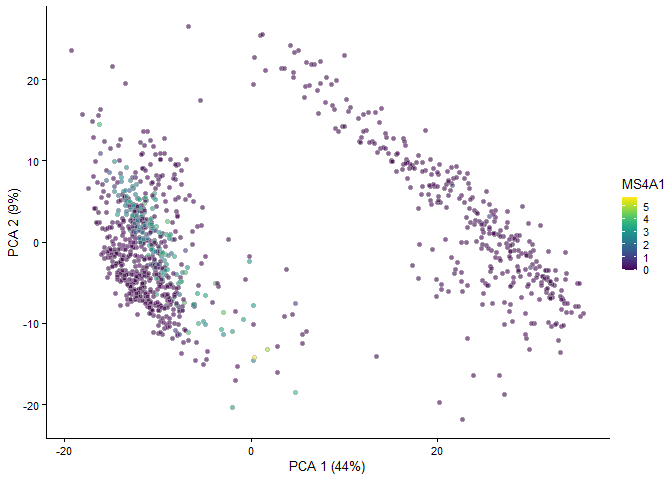<!-- -->

### Normalization: Log

In the default normalization method in Seurat, counts for each cell are
divided by the total counts for that cell and multiplied by the scale
factor 10,000. This is then log transformed.

Here we use the filtered data from the counts slot of the SCE object to
create a Seurat object. After normalization, we convert the result back
into a SingleCellExperiment object for comparing plots.

``` r
pbmc.seu <- CreateSeuratObject(counts(pbmc.sce), project = "PBMC")
pbmc.seu <- NormalizeData(pbmc.seu)
pbmc.seu.sce <- as.SingleCellExperiment(pbmc.seu)
pbmc.seu.sce <- calculateQCMetrics(pbmc.seu.sce)
```

Perform PCA and examine the normalization results with plotRLE and
plotReducedDim. This time, use “logcounts” as the expression values to
plot (or omit the parameter, as “logcounts” is the default value). Check
some marker genes, for example GNLY (NK cells) or LYZ (monocytes).

``` r
plotRLE(pbmc.seu.sce[,1:50], style = "full")
```

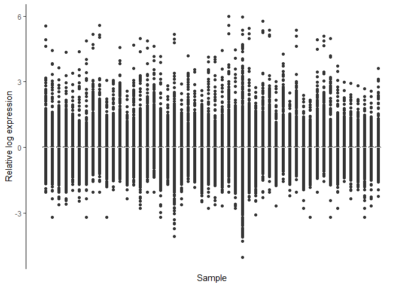<!-- -->

``` r
pbmc.seu.sce <- runPCA(pbmc.seu.sce)
scater::plotPCA(pbmc.seu.sce, colour_by = "total_counts")
```

    ## Warning: 'add_ticks' is deprecated.
    ## Use '+ geom_rug(...)' instead.

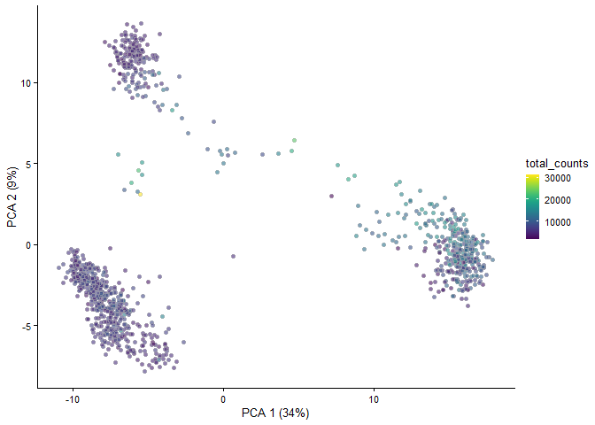<!-- -->

``` r
plotReducedDim(pbmc.seu.sce, use_dimred = "PCA", colour_by = "MS4A1")
```

    ## Warning: 'add_ticks' is deprecated.
    ## Use '+ geom_rug(...)' instead.

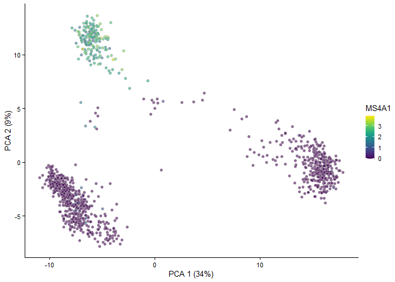<!-- -->

### Normalization: scran

The normalization procedure in scran is based on the deconvolution
method by Lun et al (2016). Counts from many cells are pooled to avoid
the drop-out problem. Pool-based size factors are then “deconvolved”
into cell-based factors for cell-specific normalization. Clustering
cells prior to normalization is not always necessary but it improves
normalization accuracy by reducing the number of DE genes between cells
in the same cluster.

``` r
qclust <- scran::quickCluster(pbmc.sce)
pbmc.sce <- scran::computeSumFactors(pbmc.sce, clusters = qclust)
summary(sizeFactors(pbmc.sce))
```

    ##    Min. 1st Qu.  Median    Mean 3rd Qu.    Max. 
    ##  0.1836  0.6380  0.8207  1.0000  1.2021  2.7399

``` r
pbmc.sce <- normalize(pbmc.sce)
```

    ## Warning in .get_all_sf_sets(object): spike-in set 'MT' should have its own
    ## size factors

Examine the results and compare to the log-normalized result. Are they
different?

``` r
plotRLE(pbmc.sce[,1:50], exprs_values = "logcounts", exprs_logged = FALSE, 
        style = "full")
```

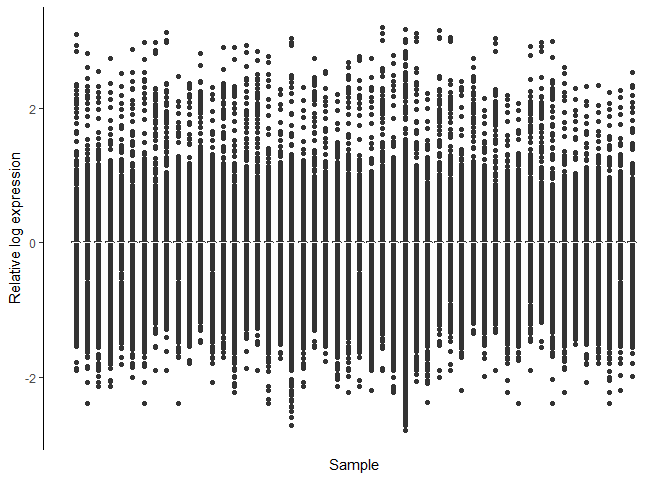<!-- -->

``` r
pbmc.sce <- runPCA(pbmc.sce)
scater::plotPCA(pbmc.sce, colour_by = "total_counts")
```

    ## Warning: 'add_ticks' is deprecated.
    ## Use '+ geom_rug(...)' instead.

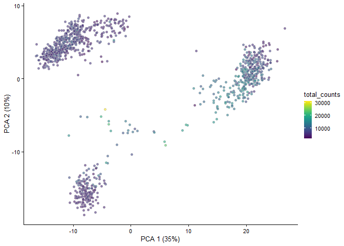<!-- -->

``` r
plotReducedDim(pbmc.sce, use_dimred = "PCA", colour_by = "MS4A1")
```

    ## Warning: 'add_ticks' is deprecated.
    ## Use '+ geom_rug(...)' instead.

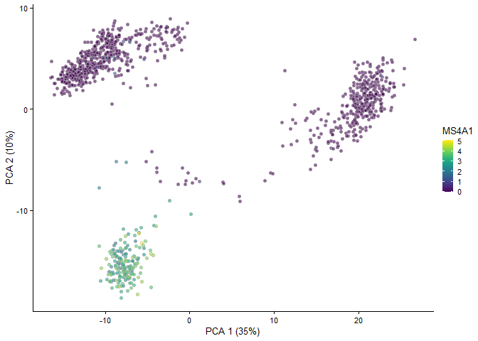<!-- -->

## 3\. Feature selection

### Feature selection: scran

In the scran method for finding HVGs, a trend is first fitted to the
technical variances. In the absence of spike-ins, this is done using the
whole data, assuming that the majority of genes are not variably
expressed. Then, the biological component of the variance for each
endogenous gene is computed by subtracting the fitted value of the trend
from the total variance. HVGs are then identified as those genes with
the largest biological components. This avoids prioritizing genes that
are highly variable due to technical factors such as sampling noise
during RNA capture and library preparation. see the [scran
vignette](https://bioconductor.org/packages/devel/bioc/vignettes/scran/inst/doc/scran.html#5_variance_modelling)
for details.

``` r
fit <- scran::trendVar(pbmc.sce, use.spikes = NA)
dec <- scran::decomposeVar(pbmc.sce, fit)
dec <- dec[!is.na(dec$FDR),]

top.hvgs <- order(dec$bio, decreasing = TRUE)
head(dec[top.hvgs,])
```

    ## DataFrame with 6 rows and 6 columns
    ##                     mean            total              bio
    ##                <numeric>        <numeric>        <numeric>
    ## S100A9   2.1798394106162 9.81200838511402 8.70848113171716
    ## S100A8  1.94717610389369 8.74191022471459 7.73278930922898
    ## LYZ     2.12848173541277 8.71130204756805 7.62859300817666
    ## HLA-DRA 2.26709495525931 5.56946701594201 4.43065009839707
    ## IGKC    1.03117091153778 4.64610433899492 3.94960628330731
    ## CD74    2.85525470083599 4.66046377538451 3.29006358386425
    ##                     tech               p.value                   FDR
    ##                <numeric>             <numeric>             <numeric>
    ## S100A9  1.10352725339686                     0                     0
    ## S100A8  1.00912091548561                     0                     0
    ## LYZ     1.08270903939139                     0                     0
    ## HLA-DRA 1.13881691754494                     0                     0
    ## IGKC    0.69649805568761                     0                     0
    ## CD74    1.37040019152026 6.00496990105324e-272 3.15447280940155e-269

``` r
dec$HVG <- (dec$FDR<0.00001)
hvg_genes <- rownames(dec[dec$FDR < 0.00001, ])

# plot highly variable genes
plot(dec$mean, dec$total, pch=16, cex=0.6, xlab="Mean log-expression",
     ylab="Variance of log-expression")
o <- order(dec$mean)
lines(dec$mean[o], dec$tech[o], col="dodgerblue", lwd=2)
points(dec$mean[dec$HVG], dec$total[dec$HVG], col="red", pch=16)
```

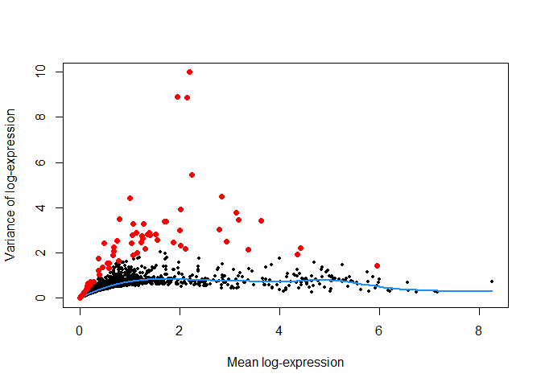<!-- -->

``` r
## save the decomposed variance table and hvg_genes into metadata for safekeeping
metadata(pbmc.sce)$hvg_genes <- hvg_genes
metadata(pbmc.sce)$dec_var <- dec
```

We choose genes that have a biological component that is significantly
greater than zero, using a false discovery rate (FDR) of 5%.

``` r
plotExpression(pbmc.sce, features = top.hvgs[1:10])
```

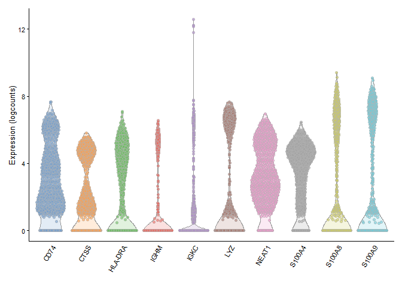<!-- -->

### Feature selection: Seurat

The default method in Seurat 3 is variance-stabilizing transformation. A
trend is fitted to to predict the variance of each gene as a function of
its mean. For each gene, the variance of standardized values is computed
across all cells and used to rank the features. By default, 2000 top
genes are returned.

``` r
pbmc.seu <- FindVariableFeatures(pbmc.seu, selection.method = "vst")
top10 <- head(VariableFeatures(pbmc.seu), 10)
vplot <- VariableFeaturePlot(pbmc.seu)
LabelPoints(plot = vplot, points = top10, repel = TRUE)
```

    ## When using repel, set xnudge and ynudge to 0 for optimal results

    ## Warning: Transformation introduced infinite values in continuous x-axis

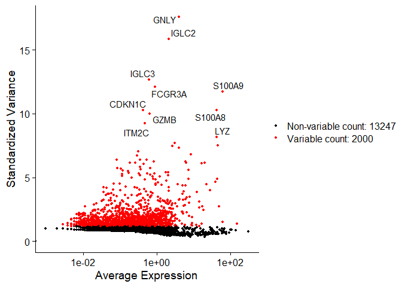<!-- -->

How many of the variable genes detected with scran are included in
VariableFeatures in Seurat?

``` r
table(hvg_genes %in% VariableFeatures(pbmc.seu))
```

    ## 
    ## FALSE  TRUE 
    ##   509   795

### Session info

``` r
sessionInfo()
```

    ## R version 3.5.3 (2019-03-11)
    ## Platform: x86_64-w64-mingw32/x64 (64-bit)
    ## Running under: Windows 10 x64 (build 17763)
    ## 
    ## Matrix products: default
    ## 
    ## locale:
    ## [1] LC_COLLATE=English_United States.1252 
    ## [2] LC_CTYPE=English_United States.1252   
    ## [3] LC_MONETARY=English_United States.1252
    ## [4] LC_NUMERIC=C                          
    ## [5] LC_TIME=English_United States.1252    
    ## 
    ## attached base packages:
    ## [1] parallel  stats4    stats     graphics  grDevices utils     datasets 
    ## [8] methods   base     
    ## 
    ## other attached packages:
    ##  [1] Matrix_1.2-17               scran_1.10.2               
    ##  [3] scater_1.10.1               ggplot2_3.1.1              
    ##  [5] SingleCellExperiment_1.4.1  SummarizedExperiment_1.12.0
    ##  [7] DelayedArray_0.8.0          BiocParallel_1.16.6        
    ##  [9] matrixStats_0.54.0          Biobase_2.42.0             
    ## [11] GenomicRanges_1.34.0        GenomeInfoDb_1.18.2        
    ## [13] IRanges_2.16.0              S4Vectors_0.20.1           
    ## [15] BiocGenerics_0.28.0         Seurat_3.0.1               
    ## 
    ## loaded via a namespace (and not attached):
    ##   [1] Rtsne_0.15               ggbeeswarm_0.6.0        
    ##   [3] colorspace_1.4-1         ggridges_0.5.1          
    ##   [5] dynamicTreeCut_1.63-1    XVector_0.22.0          
    ##   [7] BiocNeighbors_1.0.0      listenv_0.7.0           
    ##   [9] npsurv_0.4-0             bit64_0.9-7             
    ##  [11] ggrepel_0.8.1            codetools_0.2-16        
    ##  [13] splines_3.5.3            R.methodsS3_1.7.1       
    ##  [15] lsei_1.2-0               knitr_1.23              
    ##  [17] jsonlite_1.6             ica_1.0-2               
    ##  [19] cluster_2.0.9            png_0.1-7               
    ##  [21] R.oo_1.22.0              HDF5Array_1.10.1        
    ##  [23] sctransform_0.2.0        compiler_3.5.3          
    ##  [25] httr_1.4.0               assertthat_0.2.1        
    ##  [27] lazyeval_0.2.2           limma_3.38.3            
    ##  [29] htmltools_0.3.6          tools_3.5.3             
    ##  [31] rsvd_1.0.0               igraph_1.2.4.1          
    ##  [33] gtable_0.3.0             glue_1.3.1              
    ##  [35] GenomeInfoDbData_1.2.0   RANN_2.6.1              
    ##  [37] reshape2_1.4.3           dplyr_0.8.1             
    ##  [39] Rcpp_1.0.1               gdata_2.18.0            
    ##  [41] ape_5.3                  nlme_3.1-140            
    ##  [43] DelayedMatrixStats_1.4.0 gbRd_0.4-11             
    ##  [45] lmtest_0.9-37            xfun_0.7                
    ##  [47] stringr_1.4.0            globals_0.12.4          
    ##  [49] irlba_2.3.3              gtools_3.8.1            
    ##  [51] statmod_1.4.30           future_1.13.0           
    ##  [53] edgeR_3.24.3             MASS_7.3-51.4           
    ##  [55] zlibbioc_1.28.0          zoo_1.8-5               
    ##  [57] scales_1.0.0             rhdf5_2.26.2            
    ##  [59] RColorBrewer_1.1-2       yaml_2.2.0              
    ##  [61] reticulate_1.12          pbapply_1.4-0           
    ##  [63] gridExtra_2.3            stringi_1.4.3           
    ##  [65] caTools_1.17.1.2         bibtex_0.4.2            
    ##  [67] Rdpack_0.11-0            SDMTools_1.1-221.1      
    ##  [69] rlang_0.3.4              pkgconfig_2.0.2         
    ##  [71] bitops_1.0-6             evaluate_0.13           
    ##  [73] lattice_0.20-38          ROCR_1.0-7              
    ##  [75] purrr_0.3.2              Rhdf5lib_1.4.3          
    ##  [77] labeling_0.3             htmlwidgets_1.3         
    ##  [79] bit_1.1-14               cowplot_0.9.4           
    ##  [81] tidyselect_0.2.5         plyr_1.8.4              
    ##  [83] magrittr_1.5             R6_2.4.0                
    ##  [85] gplots_3.0.1.1           pillar_1.4.0            
    ##  [87] withr_2.1.2              fitdistrplus_1.0-14     
    ##  [89] survival_2.44-1.1        RCurl_1.95-4.12         
    ##  [91] tibble_2.1.1             future.apply_1.2.0      
    ##  [93] tsne_0.1-3               hdf5r_1.2.0             
    ##  [95] crayon_1.3.4             KernSmooth_2.23-15      
    ##  [97] plotly_4.9.0             rmarkdown_1.13          
    ##  [99] viridis_0.5.1            locfit_1.5-9.1          
    ## [101] grid_3.5.3               data.table_1.12.2       
    ## [103] metap_1.1                digest_0.6.19           
    ## [105] tidyr_0.8.3              R.utils_2.8.0           
    ## [107] munsell_0.5.0            beeswarm_0.2.3          
    ## [109] viridisLite_0.3.0        vipor_0.4.5
